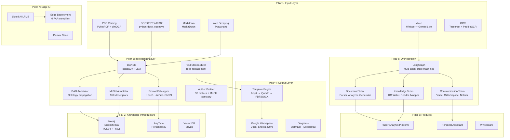

# AI Scientist Master Plan

> Cytognosis Foundation — Unified Design for the Personal Research Intelligence Platform

---

# Vision

Build an open-source, local-first **AI Scientist** platform that transforms how researchers interact with scientific knowledge. The platform ingests any document format, extracts structured content, harmonizes it against standard ontologies, stores it in a personal knowledge graph, and enables voice-driven interaction with accumulated knowledge, all while keeping sensitive data private through edge AI.

**Three core workflows:**

1. **Paper → Knowledge**: Download a PDF → fully parsed, entities extracted, ontology-mapped, stored in personal KG with citation network
2. **Voice → Artifact**: Discuss a project on the phone → structured Google Doc with experiments, timeline, references from KG
3. **Knowledge → Insight**: Query across papers, methods, authors, datasets via natural language → cross-paper analysis powered by GraphRAG

---

# Architecture Overview

---

# Pillar 1: Input Layer — Document Parsing & Format Handling

Handles ingestion from any source and format into a universal `ContentUnit`.

## Components

| Component | Tool | Status | Key Files/Docs |
|-----------|------|:------:|----------------|
| PDF parsing | PyMuPDF + PyMuPDF4LLM | ✅ Built | [entity_harmonizer.py](file:///home/mohammadi/repos/cytognosis/agents/tools/scripts/entity_harmonizer.py) |
| PDF OCR | olmOCR (Allen AI) | ⬜ Not started | Assessed in [Input Layer Optimization](../../../) conv |
| DOCX parsing | python-docx | ⬜ Not started | Skills: DOCX |
| PPTX parsing | python-pptx | ⬜ Not started | Skills: PPTX |
| XLSX parsing | openpyxl | ⬜ Not started | Skills: XLSX |
| Markdown ingestion | MarkItDown | ⬜ Not started | [research/01](research/01_framework_assessment.md) |
| Web scraping | Playwright | 🔄 Prototyped | Used for QB3 app extraction |
| BibTeX extraction | GROBID / AnyStyle | ⬜ Not started | Planned |
| Grant doc parsing | PyMuPDF + templates | 🔄 Templates built | [templates/grants/](../../templates/grants/) |
| Voice transcription | Whisper / Gemini Live | ⬜ Not started | [research/02](research/02_edge_ai_assessment.md) |
| scispaCy NER | scispaCy (Allen AI) | ⬜ Not started | Assessed, package installed |
| Format conversion | Pandoc | ⬜ Not started | Via Quarto |

## Core Abstraction: ContentUnit

Defined in [01_modular_content_architecture.md](architecture/01_modular_content_architecture.md):

- `ContentClass`: paper, grant, contract, slides, spreadsheet, form, note, meeting
- `ContentSource`: local_file, google_workspace, web_url, publisher_api, voice_transcript
- `ContentFormat`: pdf, docx, markdown, html, latex, pptx, xlsx
- `ContentAdapter`: per source+format bridge (extract ↔ generate)

## What Is Missing

1. **olmOCR integration** for scanned PDFs (assessed, not installed)
2. **GROBID** server for reference extraction (industry standard)
3. **LaTeX/BibTeX parser** for CS/engineering papers
4. **Google Docs/Sheets direct adapter** without file download
5. **WebFormAdapter** implementation (Playwright + LLM hybrid designed but not built)

---

# Pillar 2: Knowledge Infrastructure — Graph Databases & Ontologies

## Components

| Component | Status | Scale | Key Files |
|-----------|:------:|-------|-----------|
| **Neo4j Community 2025.03.0** | ✅ Installed | — | [neo4j_guide.md](../../drafts/docs/neo4j_guide.md) |
| **PKG 2.0 in Neo4j** | ✅ Imported | 36.5M papers, 774M citations | [pkg_neo4j_import.py](file:///home/mohammadi/repos/cytognosis/agents/tools/scripts/pkg_neo4j_import.py) |
| **OLS4 in Neo4j** | ✅ Loaded | 10.7M nodes, 269.6M rels, 275 ontologies | [neo4j-swap-db.sh](file:///home/mohammadi/repos/cytognosis/agents/tools/scripts/bin/neo4j-swap-db.sh) |
| **PKG explorer** | ✅ Built | — | [pkg_explorer.py](file:///home/mohammadi/repos/cytognosis/agents/tools/scripts/pkg_explorer.py) |
| **Citation networks** | ✅ Built | 6 networks tested | [citation_network.py](file:///home/mohammadi/repos/cytognosis/agents/tools/scripts/citation_network.py) |
| **AnyType personal KG** | ⬜ Not started | — | [02_personal_assistant.md](products/02_personal_assistant.md) |
| **Vector DB (Milvus)** | ⬜ Not started | — | For GraphRAG |
| **Neo4j MCP server** | ⬜ Not started | — | Planned |
| **OLS4 API client** | ⬜ Not started | — | Planned |
| **CellxGene ontologies** | ⬜ Not started | 5 core: Uberon, CL, Cellosaurus, HPO, MONDO | Planned |
| **Database swap utility** | ✅ Built | PKG ↔ OLS4 | [neo4j-swap-db.sh](file:///home/mohammadi/repos/cytognosis/agents/tools/scripts/bin/neo4j-swap-db.sh) |

## What Is Missing

1. **AnyType installation + MCP setup** (critical for personal KG)
2. **OWL ontology loader** (pronto handles OBO, need OWL for CellxGene)
3. **Neo4j MCP server** for agent integration
4. **GraphRAG pipeline** (Neo4j + vector embeddings)
5. **Cross-ontology verification** using neuropsych disease pairs

---

# Pillar 3: Intelligence Layer — Harmonization & Annotation

## Components

| Component | Status | Verified | Key Files |
|-----------|:------:|:--------:|-----------|
| **DAG Annotator** | ✅ Built | 20 MONDO annotations, propagation correct | [dag_annotator.py](file:///home/mohammadi/repos/cytognosis/agents/tools/scripts/dag_annotator.py) |
| **MeSH Annotator** | ✅ Built | 31K descriptors, 5/24 PubMed recall | [mesh_annotator.py](file:///home/mohammadi/repos/cytognosis/agents/tools/scripts/mesh_annotator.py) |
| **Biomol ID Mapper** | ✅ Built | 8/8 tests (TP53, BRCA1, aspirin, etc.) | [biomol_id_mapper.py](file:///home/mohammadi/repos/cytognosis/agents/tools/scripts/biomol_id_mapper.py) |
| **Text Standardizer** | ✅ Built | Deepest/common/highest modes | [text_standardizer.py](file:///home/mohammadi/repos/cytognosis/agents/tools/scripts/text_standardizer.py) |
| **Entity Harmonizer** | ✅ Built | PDF entity extraction | [entity_harmonizer.py](file:///home/mohammadi/repos/cytognosis/agents/tools/scripts/entity_harmonizer.py) |
| **Preprint Linker** | ✅ Built | bioRxiv/medRxiv API | [preprint_linker.py](file:///home/mohammadi/repos/cytognosis/agents/tools/scripts/preprint_linker.py) |
| **Author Profiler** | ✅ Built | S2 metrics + relevance scoring | [author_profiler.py](file:///home/mohammadi/repos/cytognosis/agents/tools/scripts/author_profiler.py) |
| **Code Entity Extractor** | ✅ Built | DESeq2: 447★, R/C++, quality 0.4 | [code_entity_extractor.py](file:///home/mohammadi/repos/cytognosis/agents/tools/scripts/code_entity_extractor.py) |
| **Data Entity Extractor** | ✅ Built | GA4GH access, scRNA-seq detected | [data_entity_extractor.py](file:///home/mohammadi/repos/cytognosis/agents/tools/scripts/data_entity_extractor.py) |
| **LLM-based NER** | ⬜ Not started | — | For post-extraction harmonization |
| **Impact factor lookup** | ⬜ Not started | — | For author relevance weighting |
| **Citation decay functions** | ⬜ Not started | — | Per bioRxiv subject area |

## Known Limitations to Address

1. **MeSH text-only matching** gets 20.8% recall vs professional indexers (need NER + full text)
2. **Author profiler** needs S2 author ID for precision (name search ambiguous)
3. **Data access classifier** occasionally misclassifies GEO as "controlled"
4. **No LLM integration** yet for entity extraction (currently regex/API-based)

---

# Pillar 4: Output Layer — Templates & Content Generation

## Components

| Component | Status | Key Files/Docs |
|-----------|:------:|----------------|
| **Jinja2 templates** | 🔄 In progress | [templates/](../../templates/) (29 files) |
| **Quarto integration** | 🔄 Assessed | [template_engine_quarto.md](research/template-engine/template_engine_quarto.md) |
| **Template schema spec** | ✅ Designed | [template_schema_specification.md](research/template-engine/template_schema_specification.md) |
| **Content extraction requirements** | ✅ Documented | [structured_content_extraction_requirements.md](research/template-engine/structured_content_extraction_requirements.md) |
| **Grant templates** | 🔄 Built (ARPA-H, NSF, NIH) | [templates/grants/](../../templates/grants/) |
| **Paper templates** | ⬜ Not started | Nature Methods, Cell, etc. |
| **Google Docs generation** | ⬜ Not started | google-api-python-client |
| **Google Slides generation** | ⬜ Not started | Slides API |
| **Mermaid diagram rendering** | ✅ In use | Mermaid CLI |
| **docxtpl (DOCX generation)** | ⬜ Not started | Backup to Quarto |

## Template Engine Stack (Decided)

| Layer | Tool | Role |
|-------|------|------|
| L0: Data | Pydantic v2 | Schema validation |
| L1: Markdown | Jinja2 | Content templating |
| L2: Rendering | Quarto + Pandoc | Multi-format output |
| L3: Styling | CSS / LaTeX templates | Visual formatting |

## What Is Missing

1. **Quarto project setup** with Cytognosis brand templates
2. **Paper template library** for major journals
3. **Google Workspace bidirectional adapter** (critical for team workflows)
4. **Web form auto-fill** (Playwright + LLM hybrid)
5. **Template reverse-engineering** (doc → template extraction)

---

# Pillar 5: Agent Orchestration — Multi-Agent System

## Architecture (Designed, Not Built)

Decision: **LangGraph** (primary), CrewAI (backup)

### Agent Teams

| Team | Agents | Role |
|------|--------|------|
| **Document** | Parser, Analyzer, Generator | Content extraction and production |
| **Knowledge** | KG Writer, KG Reader, Entity Mapper | KG CRUD and ontology mapping |
| **Communication** | Voice, GWorkspace, Notifier | User-facing I/O |

Detailed design: [02_orchestration_design.md](architecture/02_orchestration_design.md)

### Two Core Use Cases

1. **Phone → Framework → Google Doc**: Voice discussion → enriched with KG context → structured Google Doc
2. **Laptop → Framework → Personal KG**: Downloaded PDF → parsed → entities mapped → AnyType storage

### Status

| Component | Status |
|-----------|:------:|
| LangGraph state machines | ⬜ Not started |
| Agent team definitions | ⬜ Not started |
| AnyType MCP integration | ⬜ Not started |
| File watcher (watchdog) | ⬜ Not started |
| Google Workspace agents | ⬜ Not started |
| Voice pipeline | ⬜ Not started |

## What Is Missing

Everything in this pillar is designed but not implemented. The KG tools (Pillar 3) provide the foundation. Next step: implement the LangGraph orchestrator and connect existing tools as agent capabilities.

---

# Pillar 6: Products — User-Facing Applications

## Product 1: Paper Analysis & Sync Platform

Replaces/complements Zotero/Mendeley/Paperpile. See [01_paper_analysis_platform.md](products/01_paper_analysis_platform.md).

**Pipeline**: Download PDF → file watcher → DOI lookup → deep parsing (PyMuPDF) → entity extraction (scispaCy + LLM) → ontology mapping → AnyType KG + Neo4j + Google Drive

| Feature | Status |
|---------|:------:|
| PDF parsing pipeline | ✅ Entity harmonizer works |
| DOI/metadata lookup | ✅ CrossRef/S2 APIs |
| Entity extraction (NER) | ⬜ scispaCy assessed, not integrated |
| Ontology mapping | ✅ DAG/MeSH annotators |
| AnyType storage | ⬜ AnyType not installed |
| Google Drive sync | ⬜ OAuth configured (Cal.com conv) |
| File watcher | ⬜ watchdog not set up |
| Annotation extraction | ⬜ PyMuPDF annotation API |
| Voice commands | ⬜ Needs orchestration layer |

## Product 2: Personal Assistant

Voice-driven, AnyType-backed. See [02_personal_assistant.md](products/02_personal_assistant.md).

| Feature | Status |
|---------|:------:|
| AnyType object model | ✅ Designed (Task, Paper, Author, etc.) |
| Voice interface | ⬜ Not started |
| Task management | ⬜ Needs AnyType |
| Calendar integration | ⬜ Needs Google Calendar API |
| Meeting summarization | ⬜ Needs voice pipeline |
| KG-enriched conversations | ⬜ Needs GraphRAG |

## Product 3: Whiteboard

Open-source collaborative diagramming. See [03_whiteboard_design.md](architecture/03_whiteboard_design.md).

| Feature | Status |
|---------|:------:|
| Feature matrix (7 platforms) | ✅ Compiled |
| Mermaid + Excalidraw hybrid | ✅ Designed |
| Implementation | ⬜ Not started |

---

# Pillar 7: Edge AI — Local Models & Privacy

For healthcare data processing where cloud APIs are inappropriate.

## Components

| Component | Status | Key Docs |
|-----------|:------:|----------|
| Liquid AI LFM2-2.6B | ⬜ Assessed | [research/02](research/02_edge_ai_assessment.md) |
| LEAP SDK | ⬜ Assessed | — |
| Google AI Edge Gallery | ⬜ Assessed | — |
| Gemini Nano (on-device) | ⬜ Assessed | — |
| Ollama local inference | ⬜ Not started | For LLM-based NER |
| HIPAA deployment strategy | ✅ Designed | Tiered: phone → server → cloud |
| Federated learning | ⬜ Future | — |

---

# Cross-Cutting Concerns

## Skills Architecture

Skills are version-controlled at `~/repos/cytognosis/agents/skills/`. Standardized in the "Standardizing Org Skills" conversation.

| Category | Skills | Status |
|----------|--------|:------:|
| Brand | brand-identity | ✅ Standardized |
| Grants | grant-writing | ✅ Standardized |
| Science | science-platform | ✅ Standardized |
| Dev | python-standards | ✅ Standardized |
| Workspace | workspace | ✅ Standardized |
| Openness | cytognosis-openness | ✅ Standardized |
| Document processing | document-processing | 🔄 Needs update |
| Scientific databases | Organized by domain | ✅ Categorical routing |
| ToolUniverse | 57 biomedical workflows | ✅ Router skill |

## Google Workspace Integration

| Integration | Status |
|------------|:------:|
| Google OAuth | ✅ Configured (Cal.com conv) |
| Drive API | ⬜ Not started |
| Docs API | ⬜ Not started |
| Sheets API | ⬜ Not started |
| Slides API | ⬜ Not started |
| Calendar API | ⬜ Not started |

## Scientific Database Router Skills

Organized in the "Organizing Scientific Databases" conversation into 6 domains:

| Domain | Examples |
|--------|----------|
| Literature | PubMed, Semantic Scholar, bioRxiv |
| Genomics | NCBI Gene, Ensembl, ClinVar |
| Protein | UniProt, PDB, AlphaFold |
| Pathways | Reactome, KEGG, STRING |
| Chemical/Drug | ChEBI, DrugBank, PubChem |
| Clinical/Regulatory | ClinicalTrials.gov, FDA |

---

# Implementation Roadmap

## Phase 1: Foundation (Current — Mostly Complete)

> [!NOTE]
> This phase establishes the data infrastructure and basic tooling.

- [x] Neo4j installation and configuration
- [x] PKG 2.0 import (36.5M papers)
- [x] OLS4 ontology load (10.7M nodes, 275 ontologies)
- [x] DAG annotation engine with propagation
- [x] MeSH annotator with 31K descriptors
- [x] Biomolecular ID mapper (HGNC, UniProt, ChEBI, rsID)
- [x] Text standardizer
- [x] Preprint linker
- [x] Author profiler
- [x] Code/data entity extractors
- [x] Download manager with resume
- [x] Citation network builder
- [x] Database swap utility (PKG ↔ OLS4)
- [x] Entity harmonizer (PDF → ontology terms)
- [x] Org skills standardized
- [x] Scientific database skills organized

## Phase 2: Intelligence Integration (Next Priority)

> [!IMPORTANT]
> Connect existing tools into coherent pipelines.

- [ ] Install AnyType + configure MCP server
- [ ] Install and integrate scispaCy for biomedical NER
- [ ] Integrate olmOCR for scanned PDF handling
- [ ] Build OLS4 API client for remote queries
- [ ] Load CellxGene OWL ontologies (5 core)
- [ ] Verify cross-ontology edges (neuropsych disease pairs)
- [ ] Add LLM-based entity extraction layer (Ollama)
- [ ] Build impact factor lookup for author relevance
- [ ] Improve MeSH recall with NER pre-filtering
- [ ] Create marimo notebooks for ontology experiments

## Phase 3: Paper Platform MVP

- [ ] Implement file watcher (watchdog)
- [ ] Build end-to-end paper ingestion pipeline
- [ ] Connect parser → NER → ontology mapper → AnyType
- [ ] PDF annotation extraction (PyMuPDF)
- [ ] BibTeX reference extraction (GROBID)
- [ ] Google Drive sync (upload parsed papers)
- [ ] Test with 20 landmark papers from PKG
- [ ] Validate citation network extraction against PKG

## Phase 4: Orchestration Layer

- [ ] Set up LangGraph project
- [ ] Implement Router Agent (intent classification)
- [ ] Build Document Team (Parser, Analyzer, Generator)
- [ ] Build Knowledge Team (KG Writer, Reader, Mapper)
- [ ] Wire existing tools as LangGraph capabilities
- [ ] Implement Use Case 2: Laptop → Framework → KG

## Phase 5: Output & Communication

- [ ] Set up Quarto project with Cytognosis brand
- [ ] Build Google Docs generation pipeline
- [ ] Build Communication Team (Voice, GWorkspace, Notifier)
- [ ] Implement Use Case 1: Phone → Framework → Google Doc
- [ ] Build WebFormAdapter for grant portal auto-fill
- [ ] Template reverse-engineering (doc → template)

## Phase 6: Edge AI & Privacy

- [ ] Install Ollama with biomedical models
- [ ] Evaluate Liquid AI LFM2 for meeting summarization
- [ ] Build tiered inference (local → cloud fallback)
- [ ] HIPAA-compliant deployment for healthcare data

---

# Tool Inventory

## Built in This Conversation (13 scripts, 5,235+ lines)

| Script | Lines | Purpose | Git |
|--------|------:|---------|:---:|
| [dag_annotator.py](file:///home/mohammadi/repos/cytognosis/agents/tools/scripts/dag_annotator.py) | 523 | Hierarchical DAG annotation | ✅ |
| [mesh_annotator.py](file:///home/mohammadi/repos/cytognosis/agents/tools/scripts/mesh_annotator.py) | 527 | MeSH annotation + validation | ✅ |
| [biomol_id_mapper.py](file:///home/mohammadi/repos/cytognosis/agents/tools/scripts/biomol_id_mapper.py) | 476 | Gene/protein/variant/chemical mapping | ✅ |
| [text_standardizer.py](file:///home/mohammadi/repos/cytognosis/agents/tools/scripts/text_standardizer.py) | 191 | Text rewriting with canonical terms | ✅ |
| [preprint_linker.py](file:///home/mohammadi/repos/cytognosis/agents/tools/scripts/preprint_linker.py) | 222 | Preprint ↔ publication linking | ✅ |
| [author_profiler.py](file:///home/mohammadi/repos/cytognosis/agents/tools/scripts/author_profiler.py) | 290 | Author metrics + MeSH specialty | ✅ |
| [code_entity_extractor.py](file:///home/mohammadi/repos/cytognosis/agents/tools/scripts/code_entity_extractor.py) | 212 | GitHub repo quality assessment | ✅ |
| [data_entity_extractor.py](file:///home/mohammadi/repos/cytognosis/agents/tools/scripts/data_entity_extractor.py) | 313 | GA4GH access + modality detection | ✅ |
| [entity_harmonizer.py](file:///home/mohammadi/repos/cytognosis/agents/tools/scripts/entity_harmonizer.py) | — | PDF entity extraction | ✅ |
| [pkg_neo4j_import.py](file:///home/mohammadi/repos/cytognosis/agents/tools/scripts/pkg_neo4j_import.py) | — | PKG → Neo4j importer | ✅ |
| [pkg_explorer.py](file:///home/mohammadi/repos/cytognosis/agents/tools/scripts/pkg_explorer.py) | — | PKG statistics and queries | ✅ |
| [citation_network.py](file:///home/mohammadi/repos/cytognosis/agents/tools/scripts/citation_network.py) | — | Citation network construction | ✅ |
| [download_manager.py](file:///home/mohammadi/repos/cytognosis/agents/tools/scripts/download_manager.py) | — | Resumable parallel downloader | ✅ |

## Primary Technology Stack

| Layer | Primary | Backup |
|-------|---------|--------|
| **Orchestration** | LangGraph | CrewAI |
| **Personal KG** | AnyType (MCP) | Logseq |
| **Scientific KG** | Neo4j + neo4j-graphrag | — |
| **Vector DB** | Milvus | Neo4j built-in |
| **PDF** | PyMuPDF + olmOCR | — |
| **OCR** | Tesseract + PaddleOCR | VLM-based (future) |
| **Biomedical NER** | scispaCy | LLM-based |
| **Edge AI** | Liquid AI LFM2 + LEAP | Google AI Edge |
| **Templates** | Jinja2 → Quarto/Pandoc | docxtpl (DOCX) |
| **Voice** | Whisper + Gemini Live | LFM2-Audio |
| **Diagrams** | Mermaid | Excalidraw |
| **Web automation** | Playwright | — |
| **Google Workspace** | google-api-python-client | gspread |
| **Experiment mgmt** | AI2 Tango | — |
| **Data schemas** | Pydantic v2 | ruamel.yaml |

---

# Related Design Documents

| Document | Path |
|----------|------|
| **Design Index** | [README.md](README.md) |
| **Modular Content Architecture** | [01_modular_content_architecture.md](architecture/01_modular_content_architecture.md) |
| **Orchestration Design** | [02_orchestration_design.md](architecture/02_orchestration_design.md) |
| **Whiteboard Design** | [03_whiteboard_design.md](architecture/03_whiteboard_design.md) |
| **Paper Analysis Platform** | [01_paper_analysis_platform.md](products/01_paper_analysis_platform.md) |
| **Personal Assistant** | [02_personal_assistant.md](products/02_personal_assistant.md) |
| **Framework Assessment** | [01_framework_assessment.md](research/01_framework_assessment.md) |
| **Edge AI Assessment** | [02_edge_ai_assessment.md](research/02_edge_ai_assessment.md) |
| **Large-Scale Data** | [03_large_scale_data.md](research/03_large_scale_data.md) |
| **Template Engine (5 docs)** | [research/template-engine/](research/template-engine/) |
| **Neo4j Guide** | [neo4j_guide.md](../../drafts/docs/neo4j_guide.md) |
| **PKG Guide** | [pkg_guide.md](../../drafts/docs/pkg_guide.md) |
| **Source Prompts** | [AI_scientist.md](../../drafts/prompts/AI_scientist.md) |

---

# Agent Conversation Index

Work across 7+ agent conversations contributed to this plan:

| Conversation | Focus | Key Outputs |
|-------------|-------|-------------|
| **This thread** | KG infrastructure + harmonization tools | 13 scripts, Neo4j setup, PKG/OLS4 |
| Input Layer Optimization | Allen AI models (olmOCR, scispaCy), PDF parsing | Tool assessments, integration plan |
| Edge AI & Template Engine | Liquid AI, Google Edge, Quarto | Edge AI assessment, template docs |
| Organizing Scientific Databases | Database categorization by domain | 6-domain router skills |
| Standardizing Org Skills | Skill format, XML structure, critical rules | 6 skills updated |
| Template & Content Audit | Template/content inventory | materials/ reorganization |
| Reorganizing Agent Skills | CLI tool, personas, skill hierarchy | agents-cli design |
