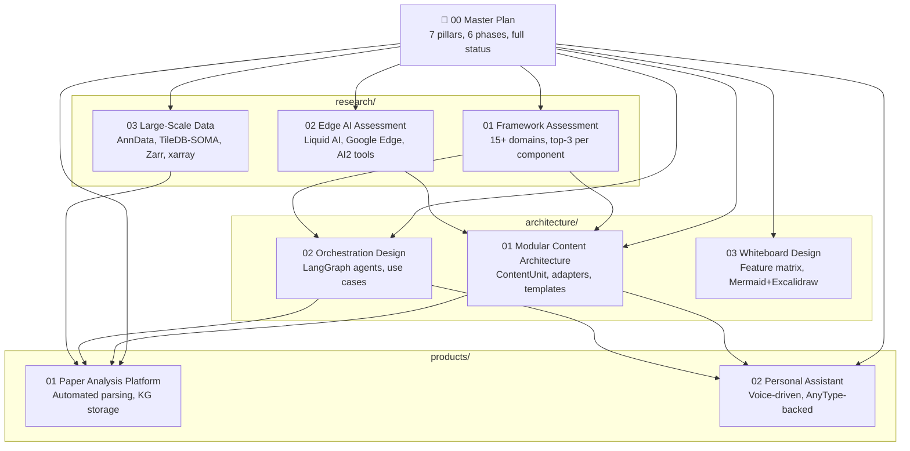

# Cytognosis Agents — Design Documents

Comprehensive research, architecture, and product design for the unified document processing, knowledge management, and AI agent ecosystem.

---

## Document Map

> **Start here**: [00_master_plan.md](00_master_plan.md) — consolidated view across all agents and design docs.

---

## Research  (`research/`)

Component-level evaluations, benchmarks, and top-candidate selections.

| # | Document | Scope | Key Decisions |
|---|----------|-------|---------------|
| 01 | [Framework Assessment](research/01_framework_assessment.md) | 15 domains: Markdown, KGs, PDF, OCR, voice, diagrams, Google Workspace, orchestration, templates, images, tables, slides, DOCX, YAML/JSON | Top-3 per component, inter-component integration matrix, skills gap analysis |
| 02 | [Edge AI Assessment](research/02_edge_ai_assessment.md) | Liquid AI LFM2 family, LEAP SDK, Google AI Edge Gallery, Gemini Nano, AI2 (olmOCR, scispaCy, Tango), healthcare edge deployment | Tiered model deployment (phone→cloud), HIPAA strategies, federated learning |
| 03 | [Large-Scale Data Storage](research/03_large_scale_data.md) | AnnData, TileDB-SOMA, Zarr, xarray, Dask for biomedical/ML workflows | TileDB-SOMA for single-cell at scale, Zarr+xarray+Dask for general arrays |
| 04 | [Paper IDE & Personal KG](research/04_paper_ide_assessment.md) | AnyType API, Zotero 7, Sioyek, LogSeq, PDF annotation standards (ISO 32000) | Zotero 7 (reading) + AnyType (personal KG), ISO 32000 embedded annotations |

## Architecture  (`architecture/`)

System-level designs, abstractions, and engineering blueprints.

| # | Document | Scope | Key Abstractions |
|---|----------|-------|------------------|
| 01 | [Modular Content Architecture](architecture/01_modular_content_architecture.md) | Universal content processing: extraction ↔ generation, web forms, Google Workspace, templates | `ContentUnit`, `ContentAdapter`, `TemplateRegistry`, `WebFormAdapter` |
| 02 | [Orchestration Design](architecture/02_orchestration_design.md) | LangGraph multi-agent system with 2 primary use cases, expansion path | Agent teams (Document, Knowledge, Communication), state machines |
| 03 | [Whiteboard Design](architecture/03_whiteboard_design.md) | Feature consolidation from 7 platforms, Mermaid+Excalidraw hybrid | Feature matrix, gap analysis, implementation priority |

## Products  (`products/`)

Specific product designs with user-facing functionality.

| # | Document | Scope | Core Workflow |
|---|----------|-------|---------------|
| 01 | [Paper Analysis Platform](products/01_paper_analysis_platform.md) | Automated paper parsing → entity extraction → KG storage, replaces Zotero/Mendeley | PDF → PyMuPDF/olmOCR → scispaCy NER → AnyType KG + Google Drive |
| 02 | [Personal Assistant](products/02_personal_assistant.md) | Voice-driven AnyType-backed assistant for tasks, calendar, references | Voice/text → LangGraph → AnyType MCP → Google Workspace sync |

---

## Primary Technology Stack

| Layer | Primary | Backup |
|-------|---------|--------|
| **Orchestration** | LangGraph | CrewAI |
| **Personal KG** | AnyType (MCP) | Logseq |
| **Scientific KG** | Neo4j + neo4j-graphrag | — |
| **Vector DB** | Milvus | Neo4j built-in |
| **PDF** | PyMuPDF + olmOCR | — |
| **OCR** | Tesseract + PaddleOCR | VLM-based (future) |
| **Biomedical NER** | scispaCy | LLM-based |
| **Edge AI** | Liquid AI LFM2 + LEAP | Google AI Edge |
| **Templates** | Jinja2 → Quarto/Pandoc | docxtpl (DOCX) |
| **Voice** | Whisper + Gemini Live | LFM2-Audio |
| **Diagrams** | Mermaid | Excalidraw |
| **Web automation** | Playwright | — |
| **Google Workspace** | google-api-python-client | gspread |
| **Experiment mgmt** | AI2 Tango | — |
| **Data schemas** | Pydantic v2 | ruamel.yaml |

---

## Status

| Phase | Status | Documents |
|-------|--------|-----------|
| Phase 1: Component Research | ✅ Complete | `research/01`, `research/02`, `research/03`, `research/04` |
| Phase 2: Comparative Analysis | ✅ Complete | Integrated into `research/01` |
| Phase 3: Architecture Design | ✅ Complete | `architecture/01`, `architecture/02`, `architecture/03` |
| Phase 4: Product Design | ✅ Complete | `products/01`, `products/02` |
| Phase 5: Skills Update | ⬜ Pending | — |

> [!NOTE]
> **Central coordination**: The [AI Scientist Master Plan](00_master_plan.md) consolidates all work across 7+ agent threads into a unified 7-pillar architecture with a 6-phase roadmap.
