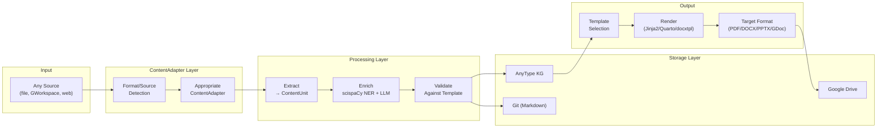
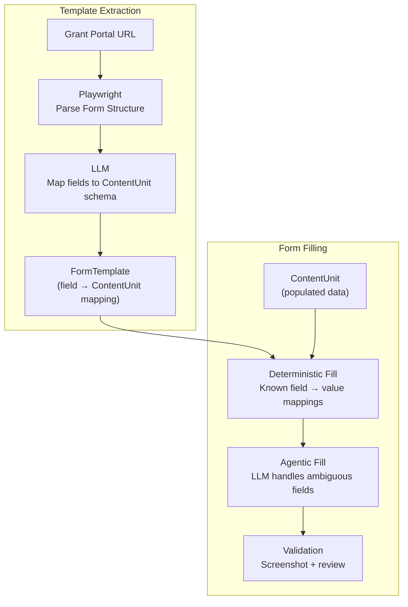

> **Navigation**: [← Design Index](../README.md) · [Research](../research/README.md) · [Architecture](README.md) · [Products](../products/README.md)

# Modular Content Processing Architecture

## Unified Template-Driven Extraction, Generation & Automation

---

# The Problem

We need a single architecture that handles:

1. **Different content types**: papers, slides, spreadsheets, forms, grants, contracts
2. **Different formats**: PDF, DOCX, PPTX, XLSX, Markdown, HTML, Google Docs/Sheets/Slides
3. **Different sources**: local files, Google Workspace, publisher websites, grant portals
4. **Different styles/templates**: Nature Methods vs Cell, NIH R01 vs ARPA-H, journal-specific formatting
5. **Both directions**: extraction (content → structured data) AND generation (structured data → content)
6. **Web form filling**: parsing online application forms, populating them, handling dynamic interactions

All seamlessly wrapped, abstracted from the user, modular, configurable, verifiable, and composable.

---

# Core Abstractions

## 1. ContentUnit: The Universal Data Container

Every piece of content, regardless of source or format, is normalized into a `ContentUnit`:

```python
from pydantic import BaseModel
from typing import Optional
from enum import Enum

class ContentClass(str, Enum):
    PAPER = "paper"
    GRANT = "grant"
    CONTRACT = "contract"
    SLIDES = "slides"
    SPREADSHEET = "spreadsheet"
    FORM = "form"            # web application forms
    NOTE = "note"
    MEETING = "meeting"
    REPORT = "report"

class ContentFormat(str, Enum):
    MARKDOWN = "markdown"
    PDF = "pdf"
    DOCX = "docx"
    PPTX = "pptx"
    XLSX = "xlsx"
    HTML = "html"
    GOOGLE_DOC = "google_doc"
    GOOGLE_SHEET = "google_sheet"
    GOOGLE_SLIDE = "google_slide"
    WEB_FORM = "web_form"

class ContentSource(str, Enum):
    LOCAL_FILE = "local_file"
    GOOGLE_WORKSPACE = "google_workspace"
    WEB_URL = "web_url"
    PUBLISHER_API = "publisher_api"   # CrossRef, Semantic Scholar
    VOICE_TRANSCRIPT = "voice_transcript"

class ContentUnit(BaseModel):
    """Universal content container — format-agnostic."""
    id: str
    content_class: ContentClass
    source: ContentSource
    original_format: ContentFormat

    # Content (always stored as structured Markdown + metadata)
    markdown: str                          # Primary content in Markdown
    metadata: dict                         # Extracted metadata (authors, DOI, etc.)
    sections: list[dict]                   # Structured sections
    tables: list[dict]                     # Extracted tables (as dicts/DataFrames)
    figures: list[dict]                    # Figure refs (path, caption, description)
    annotations: list[dict]               # Highlights, comments, notes
    entities: list[dict]                   # Extracted entities (genes, diseases, etc.)

    # Provenance
    source_uri: str                        # Original file path / URL / Google ID
    template_id: Optional[str] = None      # Which template governs this content
    style_id: Optional[str] = None         # Which style applies

    # Validation
    schema_version: str = "1.0"
    validation_errors: list[str] = []
```

## 2. ContentAdapter: Source/Format Bridge

Each source+format combination has a `ContentAdapter` that knows how to:

- **Extract**: Source → ContentUnit (parse content into our universal format)
- **Generate**: ContentUnit → Target format (render content into any output)

```python
class ContentAdapter(Protocol):
    """Interface for all content adapters."""

    def can_handle(self, source: ContentSource, fmt: ContentFormat) -> bool: ...
    def extract(self, uri: str) -> ContentUnit: ...
    def generate(self, unit: ContentUnit, target_format: ContentFormat) -> bytes | str: ...
    def validate(self, unit: ContentUnit) -> list[str]: ...
```

### Adapter Registry

| Adapter | Source | Format | Extract | Generate | Key Tool |
|---------|-------|--------|:-------:|:--------:|----------|
| `LocalPDFAdapter` | Local file | PDF | ✅ | ✅ | PyMuPDF + PyMuPDF4LLM + olmOCR |
| `LocalDOCXAdapter` | Local file | DOCX | ✅ | ✅ | python-docx + docxtpl |
| `LocalPPTXAdapter` | Local file | PPTX | ✅ | ✅ | python-pptx |
| `LocalXLSXAdapter` | Local file | XLSX | ✅ | ✅ | openpyxl + pandas |
| `LocalMarkdownAdapter` | Local file | Markdown | ✅ | ✅ | markdown-it-py + mdformat |
| `GoogleDocAdapter` | GWorkspace | Google Doc | ✅ | ✅ | Docs API v1 |
| `GoogleSheetAdapter` | GWorkspace | Google Sheet | ✅ | ✅ | gspread / Sheets API |
| `GoogleSlideAdapter` | GWorkspace | Google Slide | ✅ | ✅ | Slides API v1 |
| `GoogleDriveAdapter` | GWorkspace | Any (via Drive) | ✅ | ✅ | Drive API v3 |
| `WebFormAdapter` | Web URL | HTML form | ✅ | ✅ | Playwright + LLM |
| `WebPageAdapter` | Web URL | HTML | ✅ | — | Playwright + BeautifulSoup |
| `MarkItDownAdapter` | Local file | Any → MD | ✅ | — | MarkItDown |
| `PandocAdapter` | Local file | Any ↔ Any | ✅ | ✅ | Pandoc (via pypandoc) |

## 3. TemplateRegistry: Style Governance

Templates define the expected structure and style for a content class:

```python
class ContentTemplate(BaseModel):
    """Template definition governing content structure and style."""
    id: str                                    # e.g., "nature_methods_paper"
    content_class: ContentClass
    name: str                                  # Human-readable name
    description: str

    # Structure
    required_sections: list[str]               # e.g., ["Abstract", "Introduction", "Methods"]
    optional_sections: list[str]
    section_order: list[str]                   # Canonical ordering
    metadata_schema: dict                      # Pydantic model or JSON Schema

    # Style
    style: dict                                # Fonts, colors, margins, etc.
    citation_style: str                        # CSL style name (e.g., "nature")

    # Rendering
    jinja2_template: Optional[str]             # Jinja2 template for MD generation
    quarto_template: Optional[str]             # Quarto template for PDF/HTML/DOCX
    docx_template: Optional[str]               # Reference DOCX for docxtpl
    pptx_template: Optional[str]               # Reference PPTX master

    # Validation rules
    validators: list[dict]                     # Field-level validation rules
```

### Template Examples

| Template ID | Class | Sections | Citation | Output Formats |
|-------------|-------|----------|----------|---------------|
| `nature_methods_paper` | Paper | Abstract, Intro, Results, Methods, Discussion | Nature | PDF (LaTeX), DOCX |
| `cell_paper` | Paper | Summary, Intro, Results, Discussion, STAR Methods | Cell | PDF (LaTeX), DOCX |
| `nih_r01_grant` | Grant | Specific Aims, Significance, Innovation, Approach | NIH | PDF, Google Doc |
| `arpa_h_grant` | Grant | Technical Volume, Management Plan, Budget | ARPA-H | PDF, Google Doc |
| `lab_meeting_slides` | Slides | Title, Background, Data, Analysis, Next Steps | — | PPTX, Google Slides |
| `consulting_contract` | Contract | Scope, Timeline, Deliverables, Compensation, Terms | — | DOCX, PDF |

---

# Pipeline Architecture

## Processing Pipeline (Extract + Analyze + Generate)



## Quarto Integration

Quarto fits as our **cross-format scientific publishing engine**, bridging Markdown → PDF/DOCX/HTML/slides:

```
ContentUnit (structured Markdown + metadata)
    ↓
Jinja2 renders → Quarto .qmd file (YAML frontmatter + Markdown body)
    ↓
Quarto + Pandoc → PDF (via LaTeX), DOCX (via reference doc),
                  HTML (via themes), RevealJS slides, PPTX (via reference)
```

### Template Engine Stack (Unified)

| Layer | Tool | Role | Input | Output |
|-------|------|------|-------|--------|
| **L0: Data** | Pydantic models | Schema validation | Raw data | Typed objects |
| **L1: Markdown** | Jinja2 | Content templating | Pydantic data | Markdown + YAML |
| **L2: Format** | Quarto / Pandoc | Cross-format rendering | Markdown | PDF / DOCX / HTML / Slides |
| **L2-alt: DOCX** | docxtpl | Word-native templating | Pydantic data | DOCX (branded) |
| **L2-alt: PPTX** | python-pptx | Slide-native templating | Pydantic data | PPTX (branded) |
| **L2-alt: GWorkspace** | Google APIs | Cloud-native output | Pydantic data | Google Docs/Slides |

### Extraction → Generation Flow

| Direction | Example | Tool Chain |
|-----------|---------|------------|
| **Extract** (Paper PDF → ContentUnit) | Download Nature paper → parse → entities → KG | PyMuPDF/olmOCR → scispaCy → AnyType |
| **Generate** (ContentUnit → Grant PDF) | KG data → ARPA-H template → grant PDF | Jinja2 → Quarto → PDF |
| **Transform** (DOCX → Google Doc) | Local contract → Google Workspace | python-docx extract → Docs API create |
| **Fill** (ContentUnit → Web Form) | Grant data → online portal | Playwright + LLM |

---

# Web Form Automation

## Architecture: Deterministic + Agentic Hybrid



### WebFormAdapter Implementation

```python
class WebFormAdapter(ContentAdapter):
    """Handles web-based application forms."""

    async def extract_template(self, url: str) -> FormTemplate:
        """Parse form structure → reusable template."""
        async with async_playwright() as p:
            page = await p.chromium.launch().new_page()
            await page.goto(url)
            # Extract all form fields, labels, types, validation rules
            fields = await self._extract_fields(page)
            # LLM maps field labels → ContentUnit schema paths
            mapping = await self._llm_map_fields(fields)
            return FormTemplate(url=url, fields=fields, mapping=mapping)

    async def fill(self, unit: ContentUnit, template: FormTemplate) -> None:
        """Fill form using deterministic mapping + agentic fallback."""
        async with async_playwright() as p:
            page = await p.chromium.launch(headless=False).new_page()
            await page.goto(template.url)

            for field in template.fields:
                value = self._resolve_value(unit, field, template.mapping)
                if value and field.deterministic:
                    # Deterministic: known mapping, just fill
                    await self._fill_field(page, field, value)
                elif value:
                    # Agentic: LLM decides how to interact
                    await self._agentic_fill(page, field, value)

            # Validation: screenshot + human review
            await page.screenshot(path="form_preview.png")
```

### Dynamic Form Handling

| Scenario | Strategy |
|----------|----------|
| Simple text fields | Deterministic fill (Playwright `fill()`) |
| Dropdowns/selects | Deterministic (Playwright `select_option()`) |
| Multi-step forms | Agentic navigation (LLM decides next button/tab) |
| Dynamic content (AJAX) | Playwright wait strategies + LLM interpretation |
| CAPTCHAs | Flag for human intervention |
| File uploads | Playwright `set_input_files()` |
| Rich text editors | Playwright `evaluate()` to set contentEditable |
| Conditional sections | LLM decides which branches to fill |

---

# Google Workspace as First-Class Source

No downloads needed — everything happens via API:

| Operation | Tool | How |
|-----------|------|-----|
| **Read Google Doc** | Docs API v1 | `documents.get()` → parse structural elements → ContentUnit |
| **Write Google Doc** | Docs API v1 | ContentUnit → `batchUpdate()` with insertText/insertTable |
| **Read Google Sheet** | gspread / Sheets API | `worksheet.get_all_records()` → DataFrame → ContentUnit |
| **Write Google Sheet** | gspread / Sheets API | ContentUnit.tables → `worksheet.update()` |
| **Read Google Slide** | Slides API v1 | `presentations.get()` → parse slides → ContentUnit |
| **Write Google Slide** | Slides API v1 | ContentUnit → `batchUpdate()` with create/replace |
| **Read Drive file** | Drive API v3 | Download → appropriate local adapter |

### Key: Google IDs as URIs

```
google://docs/1abc2def3ghi     → GoogleDocAdapter
google://sheets/1xyz2abc3def   → GoogleSheetAdapter
google://slides/1foo2bar3baz   → GoogleSlideAdapter
/path/to/local/file.pdf        → LocalPDFAdapter
https://example.com/form        → WebFormAdapter
```

---

# Packaging as Skills + AnyType Integration

## As Agent Skills

Each adapter + template combination becomes a composable skill:

| Skill | Capabilities |
|-------|-------------|
| `content-extraction` | Detect format/source → route to adapter → extract ContentUnit |
| `content-generation` | ContentUnit + template → render to target format |
| `template-management` | CRUD templates, validate against schema |
| `web-form-automation` | Parse forms, create templates, fill with ContentUnit data |
| `google-workspace-sync` | Bidirectional read/write for all GWorkspace formats |
| `paper-analysis` | PDF → olmOCR/PyMuPDF → scispaCy NER → KG storage |
| `grant-generation` | KG data → template → formatted grant document |

## AnyType Object Types for Templates

| Object Type | Properties | Relations |
|-------------|-----------|-----------|
| **ContentTemplate** | id, name, content_class, schema_version | → Sections, Style, Validators |
| **Section** | name, required, order, description | → ContentTemplate |
| **Style** | fonts, colors, margins, citation_style | → ContentTemplate |
| **FormTemplate** | url, fields, mapping, last_updated | → ContentTemplate |

> **Decision**: Store template *definitions* in AnyType (metadata, relationships).
> Store template *files* (Jinja2, Quarto, reference DOCX/PPTX) in git repos referenced by AnyType objects.
> This gives us version control for templates + graph relationships in AnyType.

---

# Validation & Reproducibility

## Validation Pipeline

```python
class ContentValidator:
    def validate(self, unit: ContentUnit, template: ContentTemplate) -> list[str]:
        errors = []
        # 1. Schema validation (Pydantic)
        errors += self._validate_schema(unit, template.metadata_schema)
        # 2. Required sections
        errors += self._validate_sections(unit, template.required_sections)
        # 3. Content rules (word counts, citation formats)
        errors += self._validate_rules(unit, template.validators)
        # 4. Entity validation (are gene symbols valid HGNC?)
        errors += self._validate_entities(unit.entities)
        return errors
```

## Reproducibility: AI2 Tango Integration

Each processing step is a cacheable Tango Step:

```
ParseStep → ExtractStep → EnrichStep → ValidateStep → GenerateStep
   ↓            ↓            ↓             ↓              ↓
 (cached)    (cached)     (cached)      (cached)       (cached)
```

Change the NER model? → Only re-run EnrichStep and downstream.
Change the template? → Only re-run GenerateStep.
Same input + same config → instant cached result.
