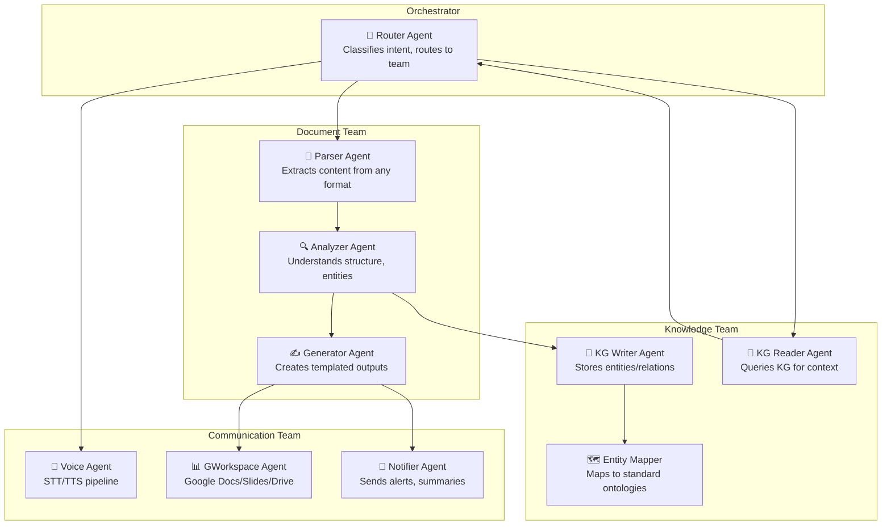
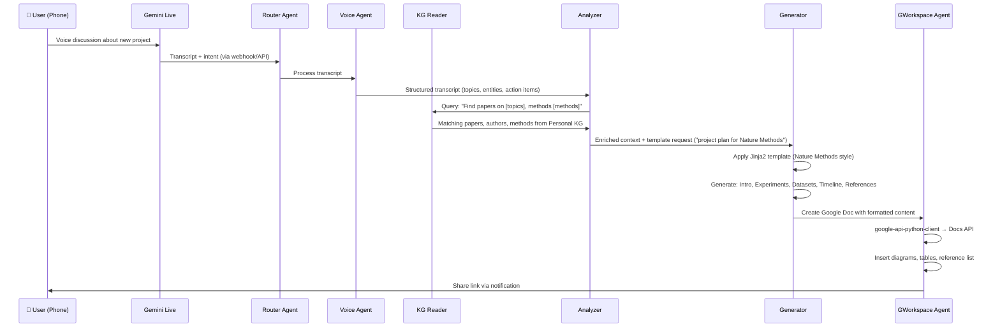
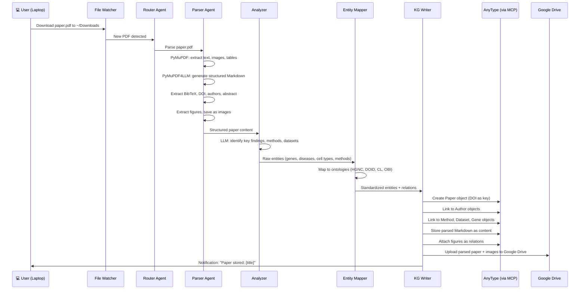

> **Navigation**: [← Design Index](../README.md) · [Research](../research/README.md) · [Architecture](README.md) · [Products](../products/README.md)

# Orchestration Architecture Design
## Multi-Agent System with LangGraph

---

# Core Orchestration: LangGraph

LangGraph provides graph-based state machines with durable state, human-in-the-loop, and provider-agnostic LLM support. Our agents communicate via structured message passing with typed state.

## Agent Team Structure



---

# Use Case 1: Phone → Framework → Google Doc

**Scenario**: Discuss a new project on the phone with Gemini, then generate a structured Google Doc with experiments, timeline, and references from personal KG.

## Data Flow



## LangGraph State

```python
from typing import TypedDict, Annotated, Literal
from langgraph.graph import StateGraph

class ProjectPlanState(TypedDict):
    # Input
    transcript: str
    intent: Literal["project_plan", "summary", "action_items"]
    template_name: str  # e.g., "nature_methods_project"
    
    # Processing
    topics: list[str]
    entities: list[dict]  # {name, type, ontology_id}
    action_items: list[str]
    
    # KG context
    related_papers: list[dict]
    related_methods: list[dict]
    
    # Output
    generated_doc: str  # Markdown
    google_doc_url: str
    messages: list  # Agent communication log
```

## Technical Stack

| Component | Tool | Notes |
|-----------|------|-------|
| Voice input | Gemini Live API → transcript | Or Whisper for local |
| Transcript → Framework | Webhook / Cloud Function | JSON payload with transcript |
| Entity extraction | LLM (Claude/Gemini) | Via LangGraph tool |
| KG query | AnyType MCP / Neo4j Cypher | Papers, methods, datasets |
| Template | Jinja2 (`nature_methods_project.j2`) | Customizable per journal style |
| Doc generation | `google-api-python-client` | Docs API v1 |
| Notification | Email / Push / Slack | Via GWorkspace Agent |

---

# Use Case 2: Laptop → Framework → Personal KG

**Scenario**: Download papers from browser → automatically parse, extract entities, store in AnyType KG with full metadata.

## Data Flow



## AnyType Object Types

| Object Type | Properties | Relations |
|-------------|-----------|-----------|
| **Paper** | DOI, title, abstract, year, journal, bibtex | → Authors, Methods, Datasets, Genes |
| **Author** | name, ORCID, affiliation | → Papers, Institutions |
| **Method** | name, description, OBI ID | → Papers, Datasets |
| **Dataset** | name, source, accession | → Papers, Methods |
| **Gene** | symbol, HGNC ID, full name | → Papers, Diseases, Pathways |
| **Disease** | name, DOID | → Papers, Genes |
| **CellType** | name, CL ID | → Papers, Datasets |
| **ReadingNote** | content, created_date | → Paper, Tags |

## Technical Stack

| Component | Tool |
|-----------|------|
| File watching | `watchdog` (Python) |
| PDF parsing | PyMuPDF + PyMuPDF4LLM |
| Entity extraction | LLM (Claude/Gemini) + custom NER |
| Ontology mapping | bionty (Lamin) / custom lookup |
| KG storage | AnyType MCP Server |
| Large KG | Neo4j (scientific community graph) |
| File storage | Google Drive API |
| Orchestration | LangGraph |

---

# Expansion Path

## Phase 1: Unidirectional (Build → Store)
- Laptop papers → KG (Use Case 2)
- Phone transcript → Google Doc (Use Case 1)

## Phase 2: Bidirectional Context
- KG context → AI assistant (personal knowledge enrichs conversations)
- Google Drive → Framework (load any stored artifact back)

## Phase 3: Continuous Learning
- KG auto-updates when new papers cite stored ones
- Meeting notes auto-enriched with team KG context
- Task/project management via AnyType + voice commands

## Phase 4: Multi-User
- Team KG sharing (AnyType spaces)
- Collaborative paper review workflows
- Shared agent teams with role-based access

---

# Meeting Summarization Extension

Same architecture as Use Case 1, but with:
- **Input**: Gemini note-taker transcript (multiple meetings)
- **Context**: Personal/team KG provides: project context, participant roles, action item history
- **Templates**: Meeting summary, Action items, Decision log, Follow-up tasks
- **Output**: Google Doc (shared) + AnyType tasks (personal) + Calendar events (Google Calendar API)
