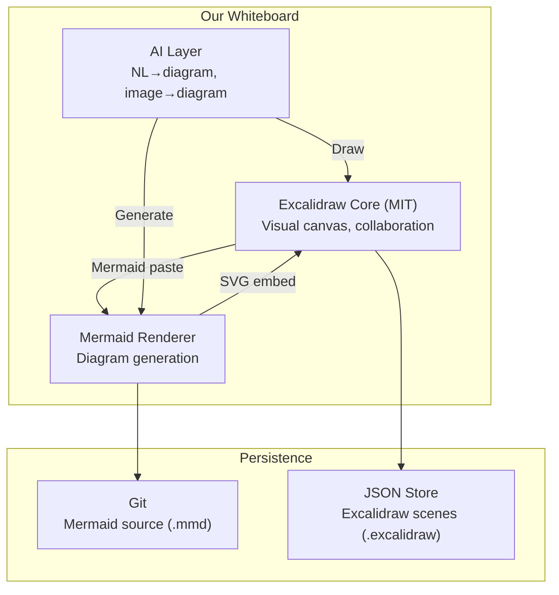

> **Navigation**: [← Design Index](../README.md) · [Research](../research/README.md) · [Architecture](README.md) · [Products](../products/README.md)

# Whiteboard Design Document
## Unified Feature Set & Implementation Path

---

# Consolidated Feature Matrix

Features compiled from: **Excalidraw**, **draw.io**, **Miro**, **FigJam**, **LucidSpark**, **Mermaid Whiteboard**, **ClickUp Whiteboard**

| Feature | Excalidraw | draw.io | Miro | FigJam | LucidSpark | Mermaid WB | ClickUp WB |
|---------|:---:|:---:|:---:|:---:|:---:|:---:|:---:|
| **Canvas** | | | | | | | |
| Infinite canvas | ✅ | ✅ | ✅ | ✅ | ✅ | ✅ | ✅ |
| Grid/snap-to-grid | ✅ | ✅ | ✅ | ✅ | ✅ | ✅ | ✅ |
| Zoom/pan | ✅ | ✅ | ✅ | ✅ | ✅ | ✅ | ✅ |
| Minimap navigation | ❌ | ✅ | ✅ | ❌ | ✅ | ❌ | ✅ |
| Dark mode | ✅ | ✅ | ✅ | ✅ | ❌ | ✅ | ✅ |
| **Drawing** | | | | | | | |
| Freehand drawing | ✅ | ✅ | ✅ | ✅ | ✅ | ❌ | ✅ |
| Hand-drawn aesthetic | ✅ | ✅ (sketch mode) | ❌ | ❌ | ❌ | ❌ | ❌ |
| Basic shapes (rect, circle, etc.) | ✅ | ✅ | ✅ | ✅ | ✅ | ✅ | ✅ |
| Connectors/arrows | ✅ | ✅ | ✅ | ✅ | ✅ | ✅ | ✅ |
| Elbow arrows | ✅ | ✅ | ✅ | ✅ | ✅ | ❌ | ✅ |
| Smart connectors (auto-routing) | ❌ | ✅ | ✅ | ✅ | ✅ | ❌ | ✅ |
| Line polygons/closure | ✅ | ✅ | ❌ | ❌ | ❌ | ❌ | ❌ |
| **Text & Content** | | | | | | | |
| Rich text editing | ⚠️ Basic | ✅ | ✅ | ✅ | ✅ | ⚠️ | ✅ |
| Markdown in nodes | ❌ | ⚠️ | ❌ | ❌ | ❌ | ✅ | ❌ |
| LaTeX/math support | ❌ | ❌ | ❌ | ❌ | ❌ | ✅ | ❌ |
| Sticky notes | ❌ | ✅ | ✅ | ✅ | ✅ | ❌ | ✅ |
| Image embedding | ✅ | ✅ | ✅ | ✅ | ✅ | ❌ | ✅ |
| Video/embed embedding | ❌ | ❌ | ✅ | ✅ | ✅ | ❌ | ❌ |
| URL embedding/preview | ❌ | ✅ | ✅ | ✅ | ✅ | ❌ | ✅ |
| Code blocks | ❌ | ❌ | ❌ | ❌ | ❌ | ✅ | ❌ |
| **Diagramming** | | | | | | | |
| Flowcharts | ✅ (manual) | ✅ | ✅ | ✅ | ✅ | ✅ (auto) | ✅ |
| Sequence diagrams | ❌ | ✅ (UML lib) | ❌ | ❌ | ❌ | ✅ | ❌ |
| Class diagrams | ❌ | ✅ (UML lib) | ❌ | ❌ | ❌ | ✅ | ❌ |
| ER diagrams | ❌ | ✅ | ❌ | ❌ | ❌ | ✅ | ❌ |
| Gantt charts | ❌ | ❌ | ❌ | ❌ | ❌ | ✅ | ❌ |
| Mind maps | ❌ | ✅ | ✅ | ❌ | ✅ | ✅ | ✅ |
| Auto-layout | ❌ | ✅ | ❌ | ❌ | ❌ | ✅ | ❌ |
| Shape/template libraries | ✅ | ✅ (extensive) | ✅ | ✅ | ✅ | N/A | ✅ |
| **Collaboration** | | | | | | | |
| Real-time multiplayer | ✅ | ✅ | ✅ | ✅ | ✅ | ✅ | ✅ |
| Live cursors | ✅ | ✅ | ✅ | ✅ | ✅ | ⚠️ | ✅ |
| Comments/threads | ⚠️ (Excalidraw+) | ✅ | ✅ | ✅ | ✅ | ❌ | ✅ |
| Emoji reactions | ❌ | ❌ | ✅ | ✅ | ✅ | ❌ | ✅ |
| Voting/polling | ❌ | ❌ | ✅ | ❌ | ✅ | ❌ | ❌ |
| Timer | ❌ | ❌ | ✅ | ✅ | ✅ | ❌ | ❌ |
| Video chat integration | ❌ | ❌ | ✅ | ❌ | ❌ | ❌ | ❌ |
| **AI Features** | | | | | | | |
| AI diagram generation | ❌ | ✅ | ✅ | ✅ | ✅ | ✅ | ✅ |
| Image → editable diagram | ❌ | ✅ | ❌ | ❌ | ❌ | ✅ | ❌ |
| Natural language → diagram | ❌ | ✅ | ✅ | ✅ | ✅ | ✅ | ❌ |
| Handwriting → diagram | ❌ | ❌ | ❌ | ❌ | ❌ | ✅ | ❌ |
| Smart templates | ❌ | ✅ | ✅ | ✅ | ✅ | ❌ | ✅ |
| **Data & Integration** | | | | | | | |
| Version control friendly | ⚠️ (JSON) | ⚠️ (XML) | ❌ | ❌ | ❌ | ✅ (text) | ❌ |
| API/SDK | ✅ (React) | ⚠️ | ✅ | ✅ (Figma API) | ✅ | ⚠️ | ✅ |
| Frames/sections | ✅ | ❌ | ✅ | ✅ | ✅ | ❌ | ✅ |
| Presentation mode | ⚠️ (Excalidraw+) | ❌ | ✅ | ❌ | ❌ | ❌ | ❌ |
| Export SVG | ✅ | ✅ | ⚠️ | ⚠️ | ❌ | ✅ | ❌ |
| Export PNG | ✅ | ✅ | ✅ | ✅ | ✅ | ✅ | ✅ |
| Export PDF | ❌ | ✅ | ✅ | ✅ | ✅ | ⚠️ | ❌ |
| Layers | ❌ | ✅ | ❌ | ❌ | ❌ | ❌ | ❌ |
| **Self-Hosting** | | | | | | | |
| Self-hostable | ✅ | ✅ | ❌ | ❌ | ❌ | ❌ | ❌ |
| Open-source | ✅ (MIT) | ✅ (Apache 2.0) | ❌ | ❌ | ❌ | ❌ (paid) | ❌ |
| Local-first | ✅ | ✅ | ❌ | ❌ | ❌ | ❌ | ❌ |

## Gap Analysis: Mermaid as Standard + Open-Source Implementation

### What Mermaid Provides
- ✅ Text-based, version-controlled diagrams
- ✅ 24+ diagram types (more than any single visual tool)
- ✅ AI generation (image→Mermaid, text→Mermaid)
- ✅ LaTeX/Markdown support in nodes
- ✅ Auto-layout
- ✅ SVG/PNG export

### What Mermaid Lacks (Whiteboard Gaps)
- ❌ Freehand drawing
- ❌ Infinite canvas spatial arrangement
- ❌ Sticky notes, images, embeds on canvas
- ❌ Real-time collaboration (without Mermaid Whiteboard SaaS)
- ❌ Shape manipulation (drag, resize)
- ❌ Comments/reactions/voting
- ❌ Presentation mode

## Architecture: Mermaid + Excalidraw Hybrid

### Implementation Priority

| Priority | Feature | Source |
|----------|---------|-------|
| P0 | Infinite canvas + basic shapes | Excalidraw |
| P0 | Mermaid diagram rendering inline | Mermaid + Excalidraw paste |
| P0 | Real-time collaboration | Excalidraw WebSocket |
| P1 | AI diagram generation (NL→Mermaid) | Custom LLM integration |
| P1 | Image→Mermaid conversion | Mermaid AI API or local VLM |
| P1 | Sticky notes + comments | Excalidraw extension |
| P2 | Presentation mode (frames) | Excalidraw+ reference |
| P2 | Mind map auto-layout | Mermaid mindmap type |
| P3 | Video/audio embeds | Custom plugin |
| P3 | Voting/polling | Custom plugin |
