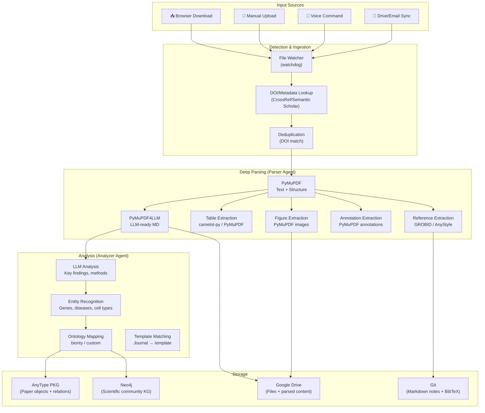

> **Navigation**: [← Design Index](../README.md) · [Research](../research/README.md) · [Architecture](../architecture/README.md) · [Products](README.md)

# Paper Analysis & Sync Platform Design
## Automated Research Paper Management

---

# Current Reference Manager Comparison

| Feature | **Zotero** | **Mendeley** | **Paperpile** | **ReadCube Papers** | **Our Platform** |
|---------|:---:|:---:|:---:|:---:|:---:|
| **Open Source** | ✅ | ❌ | ❌ | ❌ | ✅ |
| **Local-first** | ✅ | ❌ (cloud) | ❌ (cloud) | ❌ (cloud) | ✅ |
| **Auto-import from downloads** | ⚠️ (connector) | ⚠️ | ✅ (browser ext) | ⚠️ | ✅ Auto |
| **Full text parsing** | ⚠️ Basic | ⚠️ Basic | ⚠️ Basic | ⚠️ Basic | ✅ Deep (PyMuPDF + LLM) |
| **Figure extraction** | ❌ | ❌ | ❌ | ❌ | ✅ |
| **Table extraction** | ❌ | ❌ | ❌ | ❌ | ✅ |
| **Entity extraction (genes, methods)** | ❌ | ❌ | ❌ | ❌ | ✅ (LLM + NER) |
| **Ontology mapping** | ❌ | ❌ | ❌ | ❌ | ✅ (HGNC, DOID, CL) |
| **Knowledge graph backend** | ❌ | ❌ | ❌ | ❌ | ✅ AnyType + Neo4j |
| **AI summarization** | ❌ | ❌ | ❌ | ⚠️ Basic | ✅ Contextual |
| **Cross-paper analysis** | ❌ | ❌ | ❌ | ❌ | ✅ (GraphRAG) |
| **Template-based note generation** | ❌ | ❌ | ❌ | ❌ | ✅ (Jinja2) |
| **Annotation extraction** | ✅ (own format) | ⚠️ | ✅ (MetaPDF) | ⚠️ | ✅ (PyMuPDF, all formats) |
| **Google Drive sync** | ⚠️ (via WebDAV) | ❌ | ✅ | ⚠️ | ✅ Bidirectional |
| **Voice-triggered operations** | ❌ | ❌ | ❌ | ❌ | ✅ |
| **DOI as primary key** | ✅ | ✅ | ✅ | ✅ | ✅ |
| **BibTeX management** | ✅ | ✅ | ✅ | ⚠️ | ✅ |

---

# System Architecture



---

# Paper Processing Pipeline

## Step 1: Detection & Metadata

```python
# Triggered by watchdog or manual upload
pipeline = PaperIngestionPipeline(
    watch_dirs=["~/Downloads", "~/Papers"],
    file_types=[".pdf"],
    dedup_strategy="doi",  # Skip if DOI already in KG
)

# Metadata enrichment
metadata = crossref_lookup(doi)  # or semantic_scholar_api
# Returns: title, authors, journal, year, abstract, references
```

## Step 2: Deep Parsing

| Component | Tool | Output |
|-----------|------|--------|
| Full text | PyMuPDF4LLM | Structured Markdown with headers |
| Tables | PyMuPDF table detection + camelot | Markdown tables + CSV |
| Figures | PyMuPDF image extraction | PNG/SVG files + captions |
| Annotations | PyMuPDF annotation API | Highlight text + notes + coords |
| References | GROBID / AnyStyle | Structured BibTeX |
| Template | Journal detection → template match | Template config for generation |

## Step 3: Analysis & Entity Extraction

| Analysis Type | Method | Output |
|--------------|--------|--------|
| Key findings | LLM summarization | Bullet points + structured summary |
| Methods used | LLM extraction | Method names + descriptions |
| Datasets referenced | LLM + regex | Accession IDs, URLs |
| Entity extraction | LLM + spaCy NER | Genes, proteins, diseases, cell types |
| Ontology mapping | bionty / OLS API | Standard IDs (HGNC, DOID, CL, etc.) |
| Citation network | Reference parsing | DOI links to other papers |

## Step 4: KG Storage (AnyType)

```
Paper (DOI: 10.1038/...)
├── title: "Single-cell analysis of..."
├── abstract: "..."
├── journal: "Nature Methods"
├── year: 2024
├── parsed_content: [full Markdown]
├── bibtex: [BibTeX entry]
├── reading_status: "unread"
├── relations:
│   ├── → Author: "John Smith" (ORCID: ...)
│   ├── → Author: "Jane Doe" (ORCID: ...)
│   ├── → Method: "scRNA-seq" (OBI:0002631)
│   ├── → Gene: "TP53" (HGNC:11998)
│   ├── → Disease: "Lung Cancer" (DOID:1324)
│   ├── → Dataset: "GSE12345"
│   ├── → Figure: [image attachments]
│   └── → ReadingNote: [user annotations]
```

---

# Coexistence Strategy

The platform is designed to **work alongside** existing reference managers during transition:

1. **Import from Zotero/Mendeley**: Read their databases, extract papers + existing annotations
2. **BibTeX sync**: Export BibTeX to shared file that Zotero/Paperpile can also use
3. **PDF storage**: Keep original PDFs in Google Drive (accessible from anywhere)
4. **Gradual migration**: Use our platform for new papers, keep old library accessible

---

# Voice-Triggered Operations

Using the voice interface (Use Case 1 from orchestration):

| Command (Natural Language) | Action |
|---------------------------|--------|
| "Add the paper I just downloaded" | Trigger ingestion pipeline |
| "What papers do I have on [topic]?" | Query AnyType KG |
| "Summarize [paper title]" | Return structured summary from KG |
| "What methods did [author] use?" | GraphRAG query across papers |
| "Create a reading list for [project]" | Generate themed paper collection |
| "Compare methods in papers about [topic]" | Cross-paper analysis |
