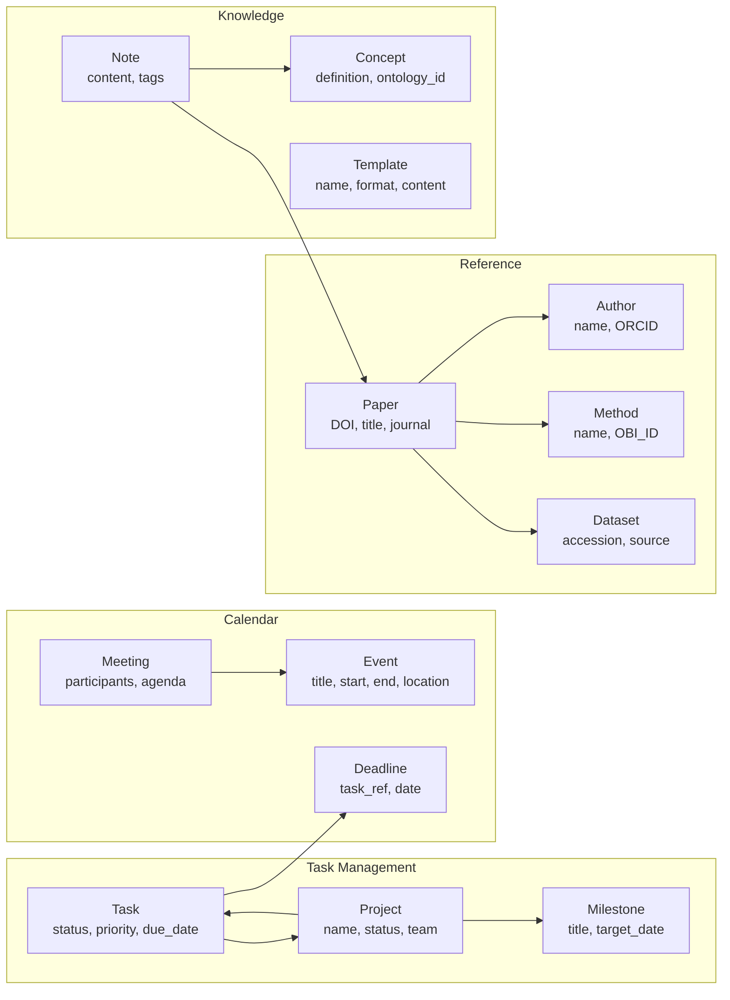
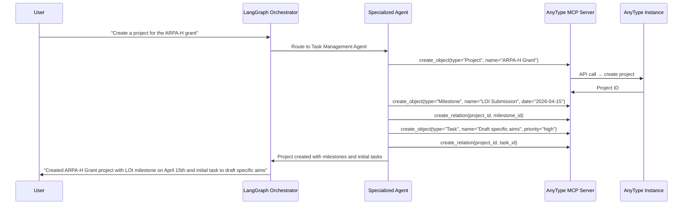

> **Navigation**: [← Design Index](../README.md) · [Research](../research/README.md) · [Architecture](../architecture/README.md) · [Products](README.md)

# Personal Assistant Design
## AnyType-Backed, Voice-Driven Personal Assistant

---

# Overview

A personal assistant that uses **AnyType** as the local-first knowledge graph backend, with **voice** as the primary interaction mode (phone), and **text/CLI** as the secondary mode (laptop). All operations go through our LangGraph orchestration layer.

---

# AnyType Object Model

## Core Object Types



---

# Interaction Modes

## Voice (Phone)

```
User speaks → Gemini Live/Whisper (STT)
    → Intent classification (LLM)
    → Route to appropriate agent
    → Execute via AnyType MCP
    → Confirm via TTS response
```

## Text/CLI (Laptop)

```
User types → CLI or chat interface
    → Intent classification
    → Route to agent
    → Execute via AnyType MCP
    → Display results in terminal/UI
```

## Webhook (Automated)

```
External trigger (email, calendar, file download)
    → Webhook → Router Agent
    → Execute pipeline
    → Store results in AnyType
    → Notify user if needed
```

---

# Common Operations

## Task & Project Management

| Voice Command | Agent Action | AnyType Operation |
|--------------|-------------|-------------------|
| "Create a task to review the scRNA-seq paper by Friday" | Parse: task="review paper", due="Friday" | Create Task object, link to Paper |
| "What's on my plate this week?" | Query tasks with due_date in current week | Set query on Tasks, sort by priority |
| "Mark the dataset preparation task as done" | Find matching task, update status | Update Task.status = "done" |
| "Start a new project for the ARPA-H grant" | Create project with default structure | Create Project + Milestones + Tasks |
| "What are the blockers for the MO-ISO project?" | Query tasks with status="blocked" in project | Filtered Set query |

## Calendar & Scheduling

| Voice Command | Agent Action | Output |
|--------------|-------------|--------|
| "Schedule a meeting with the team on Thursday at 2pm" | Create Meeting object, send Google Calendar invite | AnyType Meeting + Google Calendar event |
| "What meetings do I have tomorrow?" | Query Events/Meetings for tomorrow | Spoken/displayed list |
| "Move the paper review to next Monday" | Update event date | AnyType + Google Calendar update |
| "Block 2 hours for deep work tomorrow morning" | Create Event, mark as focus time | Calendar block |

## Reference & Paper Management

| Voice Command | Agent Action | Output |
|--------------|-------------|--------|
| "Add the paper I just downloaded" | Trigger paper ingestion pipeline | Full parsing → AnyType Paper object |
| "What papers do we have on spatial transcriptomics?" | KG query on Paper.methods/topics | List of papers with summaries |
| "Who wrote the deconvolution paper?" | Query Paper→Author relations | Author names + affiliations |
| "Create a lit review on [topic] for the grant" | Multi-paper analysis + template generation | Google Doc with structured review |
| "What datasets were used in [paper]?" | Query Paper→Dataset relations | Dataset list with accessions |

## Knowledge & Notes

| Voice Command | Agent Action | Output |
|--------------|-------------|--------|
| "Take a note about the meeting with [person]" | Transcribe → create Note, link to Meeting | AnyType Note object |
| "Reminder to follow up on the review in 3 days" | Create Task with reminder | AnyType Task + notification |
| "What did we discuss about [topic] last week?" | Search Notes by date/topic | Relevant notes summarized |

---

# AnyType MCP Integration

## Available MCP Operations

```python
# Via AnyType MCP Server
anytype_tools = {
    "create_object": "Create any object type (Task, Paper, Note, etc.)",
    "update_object": "Update properties of existing objects",
    "delete_object": "Remove objects",
    "search_objects": "Full-text search across all objects",
    "query_set": "Run filtered/sorted queries on object sets",
    "create_relation": "Link objects together",
    "get_object_graph": "Get object with all its relations",
    "list_types": "Get available object types",
    "list_spaces": "Get available spaces",
}
```

## Agent ↔ AnyType Flow



---

# Google Workspace Integration

## Bidirectional Sync

| Direction | What | How |
|-----------|------|-----|
| **AnyType → Google** | Meeting → Calendar event | AnyType webhook → Google Calendar API |
| **AnyType → Google** | Document note → Google Doc | Generate Markdown → Docs API create |
| **Google → AnyType** | Calendar event → Meeting object | Calendar API webhook → AnyType MCP |
| **Google → AnyType** | Drive file → linked reference | Drive API change notification → AnyType |

---

# Privacy & Security

| Aspect | Approach |
|--------|----------|
| **Data storage** | Local-first (AnyType), encrypted at rest |
| **Voice processing** | Whisper (local) for STT when privacy needed, Gemini for convenience |
| **LLM calls** | Configurable: local models (Ollama) or cloud APIs |
| **Google Workspace** | OAuth 2.0 with minimal scopes, token refresh |
| **Sync** | AnyType P2P sync (E2E encrypted), no central server |
