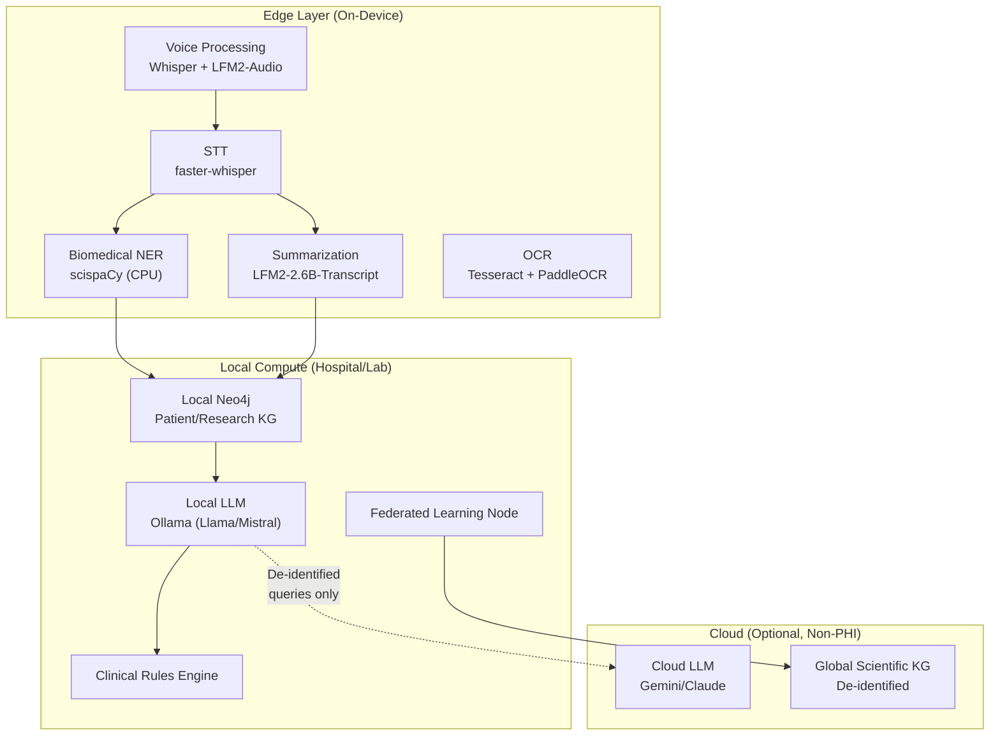

> **Navigation**: [← Design Index](../README.md) · [Research](README.md) · [Architecture](../architecture/README.md) · [Products](../products/README.md)

# Edge AI & Open Science Assessment
## Private Inference, Healthcare, and Exemplary Open-Source Tools

---

# 1. Liquid AI: LFM2 Model Family & LEAP SDK

## LFM2 Model Family

Liquid AI's LFM2 (Liquid Foundation Model 2) series uses a **hybrid architecture** combining Grouped Query Attention (GQA) with short convolutional layers — achieving significantly faster inference and lower memory than pure transformers.

### Model Matrix

| Model | Params | Modality | Context | Best For |
|-------|--------|----------|---------|----------|
| **LFM2-350M** | 350M | Text | 32K | Ultra-light tasks, IoT, keyword routing |
| **LFM2-700M** | 700M | Text | 32K | Mobile chat, simple Q&A |
| **LFM2-1.2B** | 1.2B | Text | 32K | General edge chat, summarization |
| **LFM2-2.6B** | 2.6B | Text | 32K | Meeting summarization, instruction following |
| **LFM2-VL-450M** | 450M | Vision+Language | — | Ultra-light image understanding |
| **LFM2-VL-1.6B** | 1.6B | Vision+Language | — | Image analysis, OCR, visual QA |
| **LFM2-Audio-1.5B** | 1.5B | Audio | — | Speech understanding, audio tasks |
| **LFM2-1.2B-RAG** | 1.2B | Text+RAG | — | On-device RAG, document QA |
| **LFM2-2.6B-Transcript** | 2.6B | Text | 32K | Meeting summarization, structured output |

### Key Performance Benchmarks (LFM2-2.6B)

| Metric | LFM2-2.6B | vs Competition |
|--------|-----------|---------------|
| **GSM8K** (math) | 82.41% | > Llama 3.2-3B, Gemma-3-4b, SmolLM3-3B |
| **IFEval** (instruction) | 79.56% | > 3B+ class models |
| **CPU decode speed** | 2x faster | vs Qwen3 (same class) |
| **Meeting summarization** (60min→1K summary) | **16 seconds** | On AMD Ryzen AI |
| **RAM usage** (10K tokens) | **2.7 GB** | Fits 16GB laptop with ~4GB available |
| **Power consumption** | 85% lower | vs comparable transformers (experimental) |
| **AMD Ryzen AI vs Qwen3-8B** | 59% faster | Q4_1 quantization |

### LFM2-2.6B-Transcript: Meeting Summarization

- Designed for 30–60 minute meeting transcripts
- Structured output: key discussion points, decisions, attributed action items
- Outperforms `gpt-oss-20b`, approaches Qwen3-30B and Claude Sonnet on short transcripts
- Free-form prompt mixing for customized output format
- **Production-ready for on-device meeting summarization**

## LEAP SDK (Liquid Edge AI Platform)

| Feature | Details |
|---------|---------|
| **Platforms** | iOS, Android, macOS, Mac Catalyst, JVM |
| **Offline operation** | ✅ Full inference without internet |
| **Real-time streaming** | ✅ Token-by-token generation |
| **Fine-tuning** | ✅ LEAP fine-tuning CLI → deployment-ready bundle |
| **Testing** | Apollo app for on-device "vibe checking" |
| **Android requirements** | API 31+, 3GB+ RAM |
| **Model library** | 12+ pre-trained models across text/vision/audio |
| **License** | LFM Open License (permissive for development) |

### LEAP Workflow

```
1. Find model (browse LEAP library by modality/size)
2. Test + compare (Apollo app on-device or cloud)
3. Customize (LEAP fine-tuning CLI)
4. Deploy (SDK integration, fully on-device)
```

---

# 2. Google AI Edge Gallery & Gemini Nano

## Google AI Edge SDK

| Component | Role | Status |
|-----------|------|--------|
| **Gemini Nano** | On-device SLM | Available on Pixel 8 Pro+, Galaxy S24+ |
| **AI Edge Gallery** | Model discovery + testing app | Released June 2025, iOS Feb 2026 |
| **LiteRT** (successor to TFLite) | Optimized model execution | Production |
| **MediaPipe** | Pre-built ML solutions (vision, text, audio) | Production |
| **AICore** | System service managing on-device models | Built into Android |
| **Coral NPU** | Ultra-low-power edge TPU hardware | Oct 2025 |
| **ML Kit GenAI APIs** | High-level APIs (summarize, proofread, rewrite) | Available |

### Key Capabilities

| Feature | Details |
|---------|---------|
| **Offline operation** | ✅ Fully local, no network |
| **Privacy** | ✅ Data never leaves device |
| **Hardware acceleration** | CPU, GPU, NPU via AICore |
| **Hugging Face integration** | ✅ Model import from HF Hub |
| **Supported frameworks** | TensorFlow, PyTorch, Keras, JAX |
| **Agentic features** | Mobile Actions, Tiny Garden demos |
| **Benchmarking** | Built-in LiteRT performance benchmarking |

### Comparison: LEAP SDK vs Google AI Edge

| Aspect | LEAP (Liquid AI) | Google AI Edge |
|--------|-----------------|---------------|
| **Model quality** | 🟢 Higher (LFM2-2.6B outperforms 3B class) | 🟡 Gemini Nano is capable but locked to select devices |
| **Model variety** | 🟢 Text, Vision, Audio, RAG | 🟢 Extensive via Hugging Face |
| **Device support** | 🟢 iOS, Android, macOS, JVM | 🟡 Android primary (iOS Feb 2026) |
| **Fine-tuning** | 🟢 LEAP CLI | 🟡 Via standard ML workflows |
| **Customization** | 🟢 Open weights, fine-tune, deploy | 🟡 AICore managed, less control |
| **Open-source** | 🟡 Open License (not full OSS) | 🟡 Some components open (LiteRT, Gallery) |
| **Enterprise** | 🟢 Healthcare, automotive focus | 🟢 Massive ecosystem |
| **Meeting summarization** | 🟢 LFM2-Transcript, purpose-built | 🟡 Generic summarization |

---

# 3. Allen Institute for AI (AI2) — Exemplary Open Science

AI2 is a premier example of **truly open AI research** — all models, code, and data publicly released.

## olmOCR: State-of-the-Art PDF Linearization

| Feature | Details |
|---------|---------|
| **Architecture** | Fine-tuned 7B vision-language model |
| **Purpose** | Convert complex PDFs → clean linearized text for LLMs |
| **Capabilities** | Multi-column, tables, equations, handwriting, reading order |
| **Output** | Clean Markdown preserving document structure |
| **Benchmark** | olmOCR-Bench: 7,000+ test cases across 1,400 documents |
| **Performance** | **State-of-the-art** on olmOCR-Bench, outperforms all other PDF extraction tools |
| **License** | Open-source (Apache 2.0) |

### Where olmOCR Fits in Our PDF Pipeline

```
PDF → PyMuPDF (text extraction, tables, images, annotations)
  ├─ Clean digital PDFs → PyMuPDF4LLM (sufficient)
  └─ Complex/scanned PDFs → olmOCR (superior linearization)
                              ├─ Multi-column layout
                              ├─ Equations/formulas
                              ├─ Handwritten annotations
                              └─ Complex tables
```

## scispaCy: Biomedical NLP Pipeline

| Feature | Details |
|---------|---------|
| **Base** | Full spaCy pipeline + custom models |
| **Domain** | Scientific, biomedical, clinical text |
| **Entity types** | Genes, proteins, diseases, chemicals, cell types |
| **Models** | Custom tokenizers, POS taggers, parsers, NER |
| **Training data** | GENIA, CRAFT, OntoNotes, JNLPBA |
| **License** | Apache 2.0 |

### scispaCy vs LLM-based NER

| Aspect | scispaCy | LLM-based NER |
|--------|---------|---------------|
| **Speed** | 🟢 Very fast (CPU) | 🟡 Slow (GPU/API) |
| **Accuracy** | 🟢 Domain-tuned, high precision | 🟢 Good, but can hallucinate |
| **Cost** | 🟢 Free, local | 🟡 API costs or GPU costs |
| **Edge deployment** | ✅ Lightweight | ❌ Too large |
| **Ontology linking** | ✅ UMLS, MeSH | ❌ Requires post-processing |
| **Best strategy** | **Use both**: scispaCy for fast NER → LLM for complex reasoning |

### Integration with Paper Analysis Pipeline

```
Paper text → scispaCy NER (fast, precise)
                ├─ Gene entities → HGNC mapping
                ├─ Disease entities → DOID mapping
                ├─ Chemical entities → ChEBI mapping
                └─ Cell type entities → CL mapping
             → LLM verification (complex cases only)
             → AnyType KG storage
```

## AI2 Tango: Experiment Management

| Feature | Details |
|---------|---------|
| **Architecture** | Step-based DAG (directed acyclic graph) |
| **Caching** | Smart: hashes inputs + step version (not source code) |
| **Config** | JSON, Jsonnet, or YAML experiment definitions |
| **Integration** | PyTorch, Hugging Face Transformers |
| **Python** | 3.8+ |
| **License** | Apache 2.0 |

### Tango vs Other Experiment Managers

| Aspect | AI2 Tango | MLflow | Weights & Biases | Neptune.ai |
|--------|----------|--------|-------------------|------------|
| **Design for** | 🟢 Research iteration | Production ML | Production ML | Production ML |
| **Caching** | 🟢 Step-level, smart hashing | ❌ | ❌ | ❌ |
| **DAG support** | ✅ Native | ⚠️ | ⚠️ | ⚠️ |
| **Open-source** | ✅ Apache 2.0 | ✅ (core) | ❌ (freemium) | ❌ (freemium) |
| **Self-hosted** | ✅ | ✅ | ⚠️ | ❌ |
| **Best for us** | Research pipelines | Production tracking | Team collaboration | — |

### Tango for Our Framework

Tango's step-based caching is ideal for **reproducible document processing pipelines**:
- Each processing step (parse, extract, analyze, map, store) is a cached Tango Step
- Changing a paper's analysis doesn't re-run upstream parsing
- Experiment variants (different NER models, different ontology versions) are tracked
- Can combine with LangGraph: LangGraph for agent orchestration, Tango for reproducible data pipelines

---

# 4. Edge AI for Healthcare & Private Data

## Deployment Architecture



## Model Selection Matrix for Healthcare

| Task | Edge Model | Fallback | HIPAA Safe? |
|------|-----------|----------|-------------|
| **Meeting summarization** | LFM2-2.6B-Transcript | None needed | ✅ Fully local |
| **Voice transcription** | faster-whisper | — | ✅ Local |
| **Biomedical NER** | scispaCy | — | ✅ Local, CPU |
| **Clinical image analysis** | LFM2-VL-1.6B | — | ✅ On-device |
| **Document Q&A** | LFM2-1.2B-RAG | Ollama + Llama | ✅ Local |
| **General reasoning** | Ollama (Llama 3.2 / Mistral) | Cloud LLM (de-identified) | ⚠️ Depends on data |
| **PDF linearization** | olmOCR | PyMuPDF4LLM | ✅ Local |
| **Complex analysis** | — | Gemini/Claude API (de-identified) | ⚠️ Data must be de-identified |

## Privacy Strategies

| Strategy | Implementation |
|----------|---------------|
| **Federated learning** | Train models across hospital nodes, aggregate gradients only |
| **Differential privacy** | Add noise to model updates, prevent individual identification |
| **De-identification** | Strip PHI before any cloud calls (NER-based) |
| **Edge-first** | Default to local; cloud optional and explicit |
| **Audit trail** | Log all data access, model invocations, cloud calls |

---

# 5. Unified Edge AI Strategy

## Tiered Model Deployment

| Tier | Where | Models | Use Cases |
|------|-------|--------|-----------|
| **T0: Phone** | Android/iOS | LFM2-350M, LFM2-VL-450M | Quick chat, image descriptions, voice notes |
| **T1: Laptop** | macOS/Linux/Windows | LFM2-2.6B, scispaCy, faster-whisper | Meeting summarization, document analysis, NER |
| **T2: Local GPU** | Lab/hospital server | Ollama (Llama 3, Mistral), olmOCR | Complex reasoning, PDF linearization |
| **T3: Cloud** | API (de-identified) | Gemini, Claude | Multi-step reasoning, cross-document analysis |

## Integration with Our Framework

| Component | Edge AI Addition |
|-----------|-----------------|
| **Voice pipeline** | Whisper (local) → LFM2-Audio → framework |
| **Paper pipeline** | olmOCR (complex PDFs) → scispaCy (NER) → AnyType |
| **Meeting pipeline** | Whisper → LFM2-2.6B-Transcript → structured output → AnyType |
| **Clinical pipeline** | Edge NER + edge LLM → local KG, federated updates |
| **Orchestration** | LangGraph routes to edge vs cloud based on data sensitivity |
