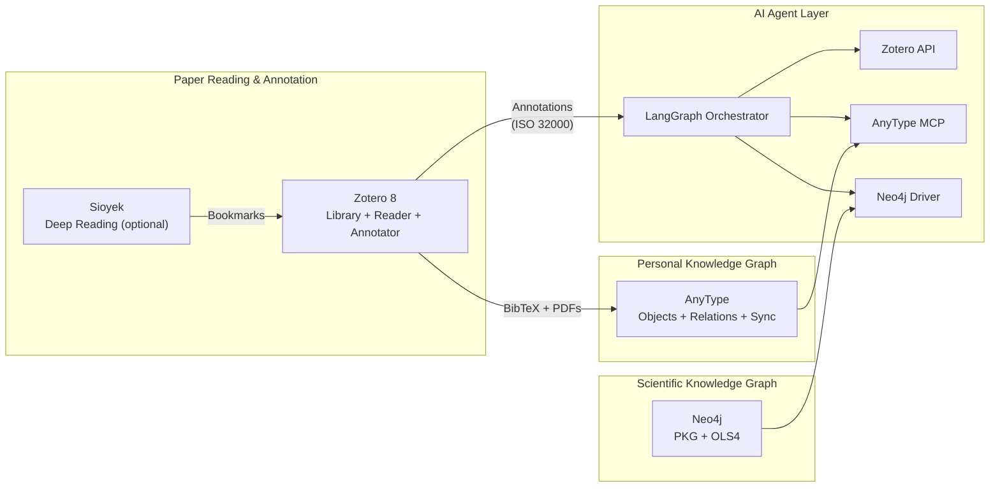
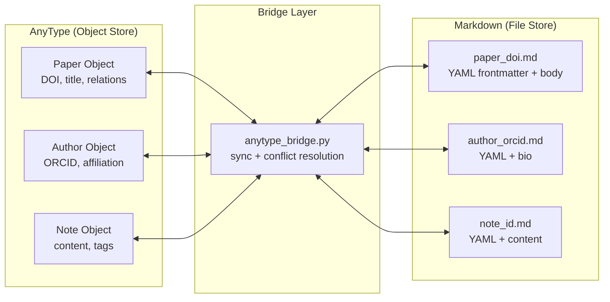

# Paper IDE & Personal KG Assessment

> Research document for selecting the paper reading/annotation IDE and personal knowledge graph backend.

---

## Part 1: AnyType Deep Dive

### Architecture

AnyType is an open-source (Any Source Available License), local-first knowledge management platform built on a CRDT-based peer-to-peer sync protocol (`any-sync`). Data lives on-device with optional self-hosted or AnyType-hosted relay sync.

| Component | Technology |
|-----------|-----------|
| Data model | Protobuf-defined blocks (any-block), CRDT-based |
| Sync | any-sync network (coordinator, sync, file, consensus nodes) |
| Storage | Local encrypted DB + S3-compatible file storage |
| API | REST (OpenAPI 3.1) + gRPC (ports 31009/31010/31011) |
| MCP Server | `@anyproto/anytype-mcp` (npm, TypeScript) |
| Desktop | Electron app (Linux/macOS/Windows) |
| Mobile | Android + iOS |

### API Capabilities (Launched May 2025)

The AnyType API provides comprehensive CRUD operations:

| Endpoint Group | Operations |
|---------------|-----------|
| Spaces & Members | List, create, join, manage membership |
| Objects & Lists | Create, read, update, delete, query, filter |
| Types & Templates | Define custom object types, manage templates |
| Properties & Tags | Create properties (formerly "relations"), manage tags |
| Global Search | Full-text search across all spaces |

**API versioning**: Header-based (`Anytype-Version: 2025-11-08`). OpenAPI 3.1 spec available.

### MCP Server Setup

```bash
# One-command setup
npx -y @anyproto/anytype-mcp get-key  # Get API key from running Anytype desktop

# MCP config for AI agents
{
  "mcpServers": {
    "anytype": {
      "command": "npx",
      "args": ["-y", "@anyproto/anytype-mcp"],
      "env": {
        "OPENAPI_MCP_HEADERS": "{\"Authorization\":\"Bearer <API_KEY>\", \"Anytype-Version\":\"2025-11-08\"}"
      }
    }
  }
}
```

Default endpoint: `http://127.0.0.1:31009`. For anytype-cli headless mode: port `31012`.

### Self-Hosting Options

| Method | Complexity | Resources |
|--------|-----------|-----------|
| Docker Compose (any-sync-dockercompose) | Low | Docker, ~2GB RAM |
| any-sync-bundle (single binary) | Very low | Docker, ~512MB RAM |
| Manual (MongoDB + MinIO + Redis) | High | Go 1.22+, multiple services |

### Fit Assessment for Cytognosis

| Requirement | AnyType Fit | Notes |
|------------|:-----------:|-------|
| Personal KG with typed objects | ✅ Excellent | Custom types, properties, relations |
| Paper storage with metadata | ✅ Excellent | Paper type with DOI, authors, etc. |
| Cross-device sync (laptop + phone) | ✅ Excellent | P2P encrypted sync built-in |
| AI agent integration | ✅ Excellent | Official MCP server, 16 releases |
| Open source | ⚠️ Partial | Any Source Available License (not OSI-approved) |
| Graph queries across objects | ⚠️ Limited | Set queries, not Cypher-level |
| Bulk import/export | ⚠️ Limited | API-based, no bulk import tool |
| PDF annotation storage | ❌ Missing | Cannot store inline PDF annotations |
| GraphRAG / vector search | ❌ Missing | No embedding support |

> [!IMPORTANT]
> AnyType excels as a personal KG for structured data (papers, tasks, authors, projects) but lacks PDF reading/annotation capabilities. It functions as the **backend knowledge store**, not the paper reading UI.

---

## Part 2: PDF Annotation Standards

### ISO 32000-2 (PDF 2.0)

The PDF spec defines annotations as objects overlaid on pages without altering source content:

| Type | Subtypes |
|------|----------|
| **Markup** | Highlight, Underline, Strikeout, Squiggly, FreeText, Ink, Stamp, Caret |
| **Non-markup** | Link, Widget (forms), 3D, Sound, Movie, Screen |
| **Notes** | Text (sticky note), Popup |

Annotations are **embedded in the PDF file**, making them portable. This is the dominant standard for academic annotation.

### W3C Web Annotation Data Model

A separate standard where annotations exist **external** to documents and are linked via selectors:

| Feature | PDF (ISO 32000) | W3C Web Annotation |
|---------|:---------------:|:------------------:|
| Storage | In-file | External JSON-LD |
| Portability | Moves with PDF | Requires server |
| Collaboration | Limited | Built-in |
| Academic adoption | Universal | Low (Hypothes.is) |
| Standards body | ISO | W3C |

### Recommendation

**Use ISO 32000 embedded PDF annotations** as the primary standard. This ensures:

- Annotations travel with the PDF (no server dependency)
- Compatibility with all major PDF readers
- PyMuPDF can read/write all annotation types programmatically

For collaborative annotation, consider Hypothes.is (W3C-based) as a future layer.

---

## Part 3: Paper Reading/Annotation IDE Comparison

### Category A: Library/Reference Managers

| Feature | **Zotero 8** | **Mendeley** | **Paperpile** |
|---------|:------------:|:------------:|:-------------:|
| Open source | ✅ AGPL-3.0 | ❌ Elsevier | ❌ Google (acquired) |
| Linux native | ✅ (incl. ARM64) | ✅ | ❌ Web-only |
| Android app | ✅ (June 2025) | ✅ | ❌ |
| iOS app | ✅ | ✅ | ❌ |
| Integrated PDF reader | ✅ Built-in (dark/black themes) | ✅ | ✅ (browser) |
| Annotation types | Highlight, note, area, ink | Highlight, note | Highlight, note |
| Annotation sync | ✅ All devices | ✅ Cloud | ✅ Cloud |
| Annotation extraction | ✅ → Notes (searchable in items list) | ⚠️ | ⚠️ |
| Native citation keys | ✅ Built-in (Z8 new) | ❌ | ❌ |
| Plugin ecosystem | ✅ 300+ | ❌ | ❌ |
| BibTeX export | ✅ (native + Better BibTeX) | ✅ | ✅ |
| OCR support | ✅ (Zotero OCR plugin) | ❌ | ❌ |
| API/automation | ✅ Zotero API | ⚠️ Limited | ❌ |
| Self-hosted sync | ✅ WebDAV | ❌ | ❌ |
| Citation integration | ✅ Word/Docs/LaTeX | ✅ Word | ✅ Docs |
| Continuous file renaming | ✅ (Z8 new) | ❌ | ❌ |
| Release cadence | Every 6-10 weeks | Slow | Slow |

**Key Zotero 8 plugins for our workflow:**

| Plugin | Purpose | Z7 Compatible |
|--------|---------|:-------------:|
| Better BibTeX | Consistent citation keys for LaTeX/Markdown | ✅ |
| ZotMoov | Auto-move attachments to custom directories | ✅ |
| Zotero OCR | Tesseract-based OCR for scanned PDFs | ✅ |
| Better Notes | Enhanced note-taking with templates | ✅ |
| Notero | Sync to Obsidian/Notion | ✅ |
| Zotero GPT | AI-powered paper summarization | ✅ |
| DOI Manager | DOI lookup and verification | ✅ |

### Category B: Research-Focused PDF Readers

| Feature | **Sioyek** | **Okular** | **Evince** |
|---------|:----------:|:----------:|:----------:|
| Open source | ✅ GPL-3.0 | ✅ GPL-2.0 | ✅ GPL-2.0 |
| Focus | Academic papers | General docs | General docs |
| Linux native | ✅ | ✅ (KDE) | ✅ (GNOME) |
| Android | 🔄 Almost ready | ❌ | ❌ |
| Smart Jump (ref lookup) | ✅ Unique | ❌ | ❌ |
| Portal (dual view) | ✅ Unique | ❌ | ❌ |
| Google Scholar search | ✅ Built-in | ❌ | ❌ |
| Keyboard-driven | ✅ Vim-like | ⚠️ | ⚠️ |
| Annotation | Highlight, bookmark | Full ISO 32000 | Highlight only |
| SyncTeX | ✅ | ✅ | ✅ |
| Customization | Config file | KDE settings | Limited |

### Category C: PKM / Note-Taking Tools

| Feature | **LogSeq** | **Joplin** | **Reor** | **Obsidian** | **AnyType** |
|---------|:----------:|:----------:|:--------:|:------------:|:-----------:|
| Open source | ✅ AGPL-3.0 | ✅ MIT | ✅ AGPL-3.0 | ❌ Proprietary | ⚠️ ASAL |
| Data format | Markdown/EDN | Markdown/SQLite | Markdown | Markdown | Protobuf/CRDT |
| Linux | ✅ | ✅ | ✅ | ✅ | ✅ |
| Android | ✅ | ✅ | ❌ | ✅ | ✅ |
| iOS | ✅ | ✅ | ❌ | ✅ | ✅ |
| Graph view | ✅ | ❌ | ❌ | ✅ | ✅ |
| PDF annotation | ✅ Built-in | ⚠️ Attach only | ⚠️ RAG only | ✅ (plugin) | ❌ |
| Bidirectional links | ✅ Blocks | ⚠️ Wiki links | ✅ Auto (AI) | ✅ | ✅ Relations |
| Flashcards | ✅ | ❌ | ❌ | ✅ (plugin) | ❌ |
| Local AI / RAG | ⚠️ Plugin | ⚠️ AI plugin | ✅ Core feature | ✅ (plugin) | ❌ |
| Plugin ecosystem | ✅ | ✅ | ❌ | ✅✅ (1500+) | ⚠️ Limited |
| Whiteboard | ✅ | ❌ | ❌ | ✅ (Canvas) | ❌ |
| E2E encryption | ✅ (sync) | ✅ | ✅ (local) | ⚠️ (paid sync) | ✅ |
| MCP server | ❌ | ❌ | ❌ | ⚠️ Community | ✅ Official |

---

## Part 4: Recommended Architecture

### Decision: Zotero + AnyType Dual-System



### Rationale

| Role | Tool | Why |
|------|------|-----|
| **Paper reading/annotating** | **Zotero 8** | Only tool with Linux + Android + iOS + integrated reader + annotation sync + open source + 300+ plugins. Gold standard for academic reference management. |
| **Deep reading (power user)** | **Sioyek** (optional) | Smart Jump + Portal for cross-referencing intensive papers. Complement, not replace, Zotero. |
| **Personal KG** | **AnyType** | Official MCP server, typed objects/relations, P2P sync, excellent API. Stores structured entities (papers, authors, methods, datasets). |
| **Scientific KG** | **Neo4j** | Already operational (PKG 36.5M + OLS4 10.7M). Graph queries, Cypher, community algorithms. |
| **PKM/Notes** | **LogSeq** (fallback) | If AnyType's note-taking proves insufficient. Block-based, PDF annotation, pure open source. |
| **Annotation standard** | **ISO 32000** (embedded PDF) | Universal compatibility. PyMuPDF reads/writes. Annotations travel with PDF. |

### Why NOT Others

| Tool | Eliminated Because |
|------|-------------------|
| Mendeley | Closed source (Elsevier), limited API |
| Paperpile | Web-only, closed source, no Linux native |
| Obsidian | Not open source (proprietary license) |
| Reor | Desktop-only (no mobile), too early stage |
| Joplin | No PDF annotation, no graph view, weak linking |

---

## Part 5: Implementation Plan

### Phase 1: AnyType Setup (This Session)

1. Install AnyType desktop (Snap or AppImage on Linux)
2. Create API key from settings
3. Configure MCP server in Antigravity
4. Test: Create Paper, Author, Method objects via MCP
5. Test: Create relations between objects
6. Test: Query and search operations

### Phase 2: Zotero Integration

1. Install Zotero 8 on Linux
2. Install essential plugins: Better BibTeX, ZotMoov, Zotero OCR
3. Configure Zotero storage to sync with project directory
4. Test: Import a PDF, annotate, extract annotations
5. Build annotation extraction pipeline (PyMuPDF reads Zotero-annotated PDFs)

### Phase 3: Bridge (Zotero ↔ AnyType)

1. Build `zotero_bridge.py`: Zotero API → extract library → AnyType MCP
2. Sync paper metadata: DOI, title, authors, journal, year
3. Sync annotations: Extract from PDFs → store as AnyType Note objects linked to Paper
4. Bidirectional: AnyType tag changes → Zotero collection updates

### Phase 3.5: Sioyek + Zotero Hybrid Strategy

Sioyek stores annotations in SQLite (not embedded in PDF). To bridge:

1. **Zotero manages the library** (metadata, collections, BibTeX, sync)
2. **Sioyek opens PDFs from Zotero's storage directory** for deep reading
3. **Sioyek's `embed_annotations`** exports annotations into the PDF when done
4. **Zotero sees the embedded annotations** on next open

**Three reading tiers:**

| Tier | When | Tool | Annotations |
|------|------|------|-------------|
| Quick triage | Scanning abstracts, skimming | Zotero built-in reader | Zotero highlights + notes |
| Deep reading | Cross-referencing, equations, dense papers | Sioyek (Smart Jump, Portals) | Sioyek SQLite → embed → PDF |
| Mobile | Reading on phone/tablet | Zotero Android/iOS | Zotero annotations (synced) |

**Keyboard workflow** (Sioyek integration via custom command):

```
# In Sioyek prefs.config:
# Open current PDF's metadata in Zotero
new_command _zotero_open python3 ~/.config/sioyek/scripts/zotero_open.py "%{file_path}"
```

### Verification

- Create 5 Paper objects in AnyType via MCP with full metadata
- Annotate 3 papers in Zotero with highlights and notes
- Open 1 paper in Sioyek, annotate, embed, verify Zotero sees annotations
- Extract annotations programmatically and verify round-trip
- Confirm sync across desktop and mobile

---

## Part 6: AnyType ↔ Markdown Bridge Strategy

### The Challenge

AnyType uses an object-centric model (Protobuf/CRDT internally) while our pipeline optimizes for markdown/text-only formats because:

- **Git**: Text diffs, version control, merge-friendly
- **LLMs**: Plain text is the native input format
- **Template engine**: Jinja2 → Quarto → PDF/DOCX/HTML from markdown

We need bidirectional conversion without information loss.

### Architecture: Dual-Format with YAML Frontmatter



### Markdown Format Convention

Every AnyType object maps to a markdown file with YAML frontmatter:

```yaml
---
# AnyType metadata (auto-managed by bridge)
anytype_id: "bafyreid..."
anytype_type: Paper
anytype_space: research
last_synced: 2026-03-04T14:00:00Z

# Object properties
title: "Single-cell RNA-seq of pancreatic cancer"
doi: "10.1038/s41592-024-01234-5"
journal: "Nature Methods"
year: 2024
citation_key: smith2024pancreatic

# Relations (as references)
authors:
  - anytype_id: "bafyreid_smith"
    name: "John Smith"
    orcid: "0000-0001-2345-6789"
  - anytype_id: "bafyreid_doe"
    name: "Jane Doe"
methods:
  - name: "scRNA-seq"
    ontology_id: "OBI:0002631"
datasets:
  - accession: "GSE12345"
    source: "GEO"
tags: ["pancreatic-cancer", "single-cell", "deconvolution"]
---

## Abstract

We present a comprehensive single-cell atlas of pancreatic...

## Key Findings

1. Identified 15 cell populations...
2. Novel deconvolution method...

## Annotations

- **Highlight (p.3)**: "The tumor microenvironment contains..."
- **Note (p.7)**: Compare with Smith et al. 2023 approach
```

### Sync Rules

| Scenario | Resolution |
|----------|------------|
| New AnyType object, no markdown | Bridge creates `.md` file |
| New markdown file, no AnyType object | Bridge creates AnyType object |
| Both modified since last sync | AnyType wins for properties, markdown wins for body content |
| AnyType relation added | Add to YAML `relations` section |
| Markdown tag added | Add to AnyType tags |
| Object deleted in AnyType | Move markdown to `.archive/` |
| Markdown deleted | Do NOT delete AnyType object (safety) |

### File Organization

```
knowledge/
├── papers/
│   ├── smith2024pancreatic.md
│   ├── doe2023deconvolution.md
│   └── ...
├── authors/
│   ├── john-smith_0000-0001-2345-6789.md
│   └── ...
├── methods/
│   ├── scrna-seq_OBI-0002631.md
│   └── ...
├── notes/
│   ├── 2026-03-04_meeting-arpa-h.md
│   └── ...
└── .bridge/
    ├── sync_state.json   # Last sync timestamps per object
    └── conflict_log.json # Conflict resolution history
```

### Why This Works

1. **Git**: Markdown files diff cleanly, YAML frontmatter is structured
2. **LLMs**: Feed the full `.md` file as context; YAML metadata is parseable
3. **Template engine**: Jinja2 reads YAML frontmatter + body, generates any format
4. **AnyType**: Remains the interactive UI for browsing, relating, searching
5. **Neo4j**: Bridge can also push relations to the scientific KG
6. **Zotero**: BibTeX export maps to `citation_key` in frontmatter
